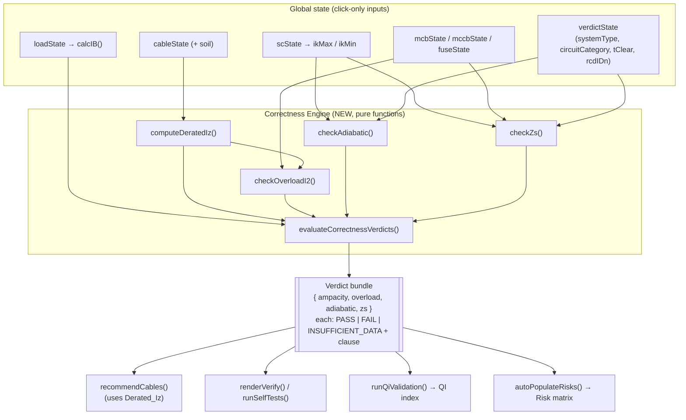
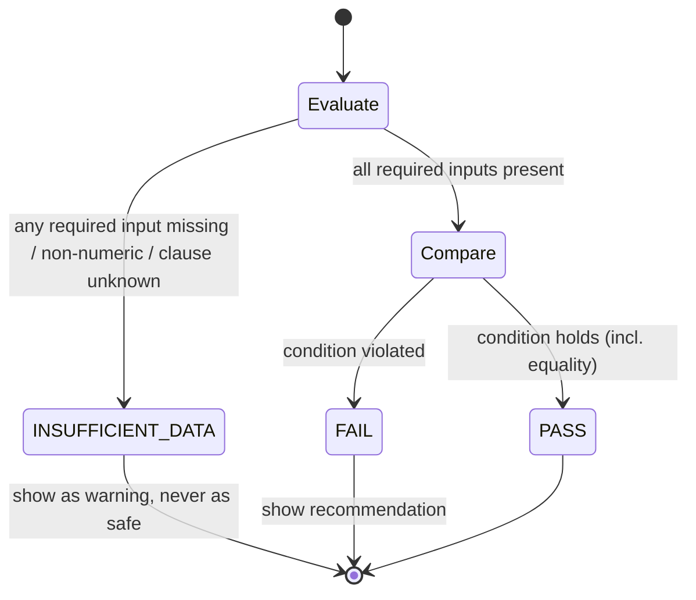

# Design Document — Dimensioning Correctness Hardening

## Overview

This feature closes four safety-correctness gaps in the single-file Danish electrical
dimensioning application `el-dimensionering.html`. Every line of JavaScript, CSS, and HTML
already lives inside that **one** file, and this design keeps it that way: the new logic is added
as a self-contained **Correctness Engine** section of the existing `<script>` block, the new data
tables are added next to the existing `const` tables, and the new UI is rendered by the existing
`renderModule(mod)` switch and bilingual `t()` mechanism. **No new files, no separate apps, no
subdirectories** are introduced.

The four verdicts implemented are:

1. **Ampacity coordination on derated capacity** (Req 1, 2) — `IB ≤ In ≤ Derated_Iz`, where
   `Derated_Iz = Base_Iz × Ca × Cg × Cs × k_install` (DS/HD 60364-5-52 §523, Annex B).
2. **Overload coordination** (Req 3) — `I₂ ≤ 1,45 × Derated_Iz` (DS/HD 60364-4-43 §433.1).
3. **Adiabatic short-circuit withstand** (Req 4) — `k²·S² ≥ I²t` (DS/HD 60364-4-43 §434.5.2).
4. **Earth-fault-loop impedance / disconnection time** (Req 5) — `Zs ≤ Zs_max = U₀/Ia` (TN) or
   `Zs × IΔn ≤ 50 V` (TT) (DS/HD 60364-4-41 §411.3.2 / §411.4 / §411.5).

The central design idea is a **single source of truth**. Today, derating is computed three times
in three slightly different ways (in `getAiAssistant` for display, twice inside `runQiValidation`)
and `recommendCables` does not derate at all — it filters on the raw table value `officialIz(c)`.
This is the root cause of the "display-only derating" bug. The design replaces all of these with
**one shared pure function per concept** (`computeDeratedIz`, `checkOverloadI2`, `checkAdiabatic`,
`checkZs`) and a single orchestrator `evaluateCorrectnessVerdicts()` whose output is consumed
**identically** by the Cable engine, the Verify module, the QI index, and the Risk matrix. Because
every view reads the same computed object, cross-view consistency (Req 7) is guaranteed by
construction rather than by careful duplication.

The engine is **conservative by default** (Req 2, 9): when a correction factor or input is not
selected, the most reducing / most pessimistic value is substituted, and any verdict whose inputs
are incomplete returns the third state `INSUFFICIENT_DATA` instead of `PASS`. All new controls are
100% click-only (Req 6), bilingual Danish-primary with English toggle (Req 8), and rendered in the
existing neon dark-mode style.

### Implementation language

The application is plain (vanilla) JavaScript embedded in one HTML file. All design code below is
JavaScript, consistent with the existing codebase. No build step, framework, or module system is
introduced.

## Architecture

### Where the new code lives in the single file

```
el-dimensionering.html
├── <style> .............................. (unchanged; reuse existing neon theme tokens)
├── <body> ............................... (unchanged structure: #mainNav, #statusBar, #mainContent)
└── <script>
    ├── Translations  T = { da, en }  .... ADD new keys (Req 8)
    ├── DATA TABLES ...................... ADD K_ADIABATIC, SOIL_FACTORS, DISCONNECT_TIME,
    │                                          FUSE_0_4S, U0/U_L constants (Data Models section)
    ├── STATE ............................ ADD verdictState; EXTEND cableState with `soil`
    ├── recommendCables / officialIz ..... REFACTOR to call deratedIzForProduct()
    ├── === CORRECTNESS ENGINE (NEW) ===   ADD pure functions + evaluateCorrectnessVerdicts()
    ├── runQiValidation .................. EXTEND to push the four verdicts as scored rules
    ├── getAiAssistant (cable) ........... REFACTOR to call computeDeratedIz() (remove duplicate)
    ├── renderCable ...................... ADD verdict inputs + verdict/provenance cards
    ├── runSelfTests / renderVerify ...... EXTEND with four self-tests + verdict panel
    └── AUTO_RISK_RULES / autoPopulateRisks  REFACTOR shock/fire/earth rules to be verdict-driven
```

### Data-flow architecture

The defining principle is **compute once, render many**. `evaluateCorrectnessVerdicts()` reads the
relevant global state, calls the four pure check functions, and returns a frozen verdict bundle.
Every consumer (Verify, QI, Risk, Cable) renders from that one bundle.



### Verdict state machine (applies to all four checks)

Each check is a pure function returning exactly one of three states. `INSUFFICIENT_DATA` is the
safe default whenever a required input is missing (Req 9.2), and it never collapses into `PASS`.



### Design decisions and rationale

- **DD-1 Single derating function.** `computeDeratedIz` is the only place `Base_Iz × Ca × Cg × Cs ×
  k_install` is evaluated. `recommendCables`, `runQiValidation`, and the cable AI assistant all call
  it. Rationale: eliminates the divergence that caused the display-only bug and makes Req 1.3
  ("any cross-module check uses Derated_Iz") true by construction.
- **DD-2 Compute-once orchestrator.** `evaluateCorrectnessVerdicts()` produces one immutable bundle
  consumed by all views. Rationale: Req 7.7 cross-view consistency without duplicated logic.
- **DD-3 Three-state verdict object.** A uniform `{ state, clause, values, message, recommendation }`
  shape is returned by every check. Rationale: Req 7 (PASS/FAIL/INSUFFICIENT_DATA everywhere) and
  Req 9 (provenance) are satisfied by one shared renderer `renderVerdictRow()`.
- **DD-4 Conservative Isc selection.** Adiabatic withstand uses the **maximum** prospective fault
  current `ikMax3ph` (largest I²t); Zs verification compares actual loop impedance against
  `Zs_max` (equivalently requires `ikMin ≥ Ia`). Rationale: each check uses the fault magnitude
  that is pessimistic for that specific check.
- **DD-5 Validation guard reconciliation.** A *defaulted* correction factor must be `≤ 1,0`
  (Req 1.8 / Req 2.5): a default may never increase capacity. A *user-selected* factor may exceed
  1,0 only because the official Annex B tables contain enhancing values (e.g. ambient below 30 °C
  → Ca up to 1,22; free-air install methods → k_install up to 1,17). The guard therefore rejects
  non-numeric values, values `< 0,01`, and any **defaulted** value `> 1,0`, while honouring
  user-selected Annex B values up to a documented ceiling. This is documented in Error Handling.

## Components and Interfaces

All components are functions added to the existing single `<script>`. Signatures use plain
JavaScript objects so each function is pure and unit/property testable in isolation.

### 1. Correction-factor resolver

```js
// Returns the active value for one correction-factor category, applying the conservative
// default (numerically lowest table value) when the key is not selected.
// category: 'ca' | 'cg' | 'cs' | 'kInstall'
function getCorrectionFactor(category, key) {
  // → { value: Number, defaulted: Boolean, valid: Boolean, source: String }
}
```

- Maps category → table: `ca`→`TEMP_FACTORS`, `cg`→`GROUP_FACTORS`, `cs`→`SOIL_FACTORS`,
  `kInstall`→`INSTALL_METHODS`.
- If `key` is present in the table → `{ value: table[key], defaulted: false }`.
- If `key` is absent/null → `{ value: min(tableValues that are ≤ 1.0), defaulted: true }`
  (most reducing value; guarantees a defaulted factor never increases capacity — Req 2.1, 2.5).
- For `cs` when the installation is **not** buried → `{ value: 1.0, defaulted: false }` (soil
  correction does not apply).

### 2. Derated ampacity

```js
function computeDeratedIz({ baseIz, caKey, cgKey, csKey, kInstallKey, buried }) {
  // → { ok, deratedIz, baseIz, totalFactor, factors:{ca,cg,cs,kInstall},
  //     defaulted:{ca,cg,cs,kInstall}, error }
}
```

- Resolves each factor via `getCorrectionFactor`.
- Validates each active factor (DD-5). On any invalid factor → `{ ok:false, error:{factor,reason} }`
  and the caller retains the previous verdict (Req 1.8).
- `totalFactor = ca × cg × cs × kInstall`.
- `deratedIz = Math.floor(baseIz × totalFactor × 100) / 100` (round **down** to 2 dp — Req 1.4).
- Returns `defaulted` flags so the UI can show the persistent conservative-default indicator
  (Req 2.3, 2.4).

```js
// Convenience wrapper used by recommendCables: derates a PRODUCT using its official base Iz table
// and the currently active environment selections.
function deratedIzForProduct(product, env) { /* → Number */ }
```

### 3. Overload coordination (I₂ ≤ 1,45 × Iz)

```js
function deviceI2(device) {
  // device = { kind:'fuse'|'mcb'|'mccb'|null, inA:Number }
  // gG fuse → 1.6 × In ; MCB/MCCB → 1.45 × In ; unknown kind → 1.6 × In (conservative, Req 3.5)
  // → { i2:Number, factor:Number, defaulted:Boolean }
}

function checkOverloadI2({ device, deratedIz }) {
  // → Verdict { state, clause:'DS/HD 60364-4-43 §433.1', values, message, recommendation }
}
```

- INSUFFICIENT_DATA when `device.inA` or `deratedIz` is missing, zero, or negative (Req 3.7).
- PASS when `round2(i2) ≤ round2(1.45 × deratedIz)` (equality passes — Req 3.2); else FAIL with a
  recommendation to increase cross-section or pick a lower-I₂ device (Req 3.3).

### 4. Adiabatic withstand (k²·S² ≥ I²t)

```js
function adiabaticK(material, insulation) {
  // → Number | null   (K_ADIABATIC lookup; null → INSUFFICIENT_DATA, Req 4.7)
}

function nextStandardCrossSection(sMin) {
  // smallest value in STANDARD_CSA that is ≥ sMin → Number | null (Req 4.4, 4.8)
}

function checkAdiabatic({ material, insulation, sArea, isc, tClear }) {
  // → Verdict { state, clause:'DS/HD 60364-4-43 §434.5.2', values:{k,i2t,withstand,sMin}, ... }
}
```

- INSUFFICIENT_DATA when `isc` or `tClear` is unknown (Req 4.6) or `k` is undefined (Req 4.7).
- `i2t = isc² × tClear`; `withstand = k² × sArea²`; `sMin = Math.sqrt(i2t) / k`.
- PASS when `withstand ≥ i2t`; else FAIL, recommending `nextStandardCrossSection(sMin)`; if none
  exists → FAIL with "no available cross-section meets withstand" (Req 4.8).

### 5. Earth-fault-loop impedance / disconnection time

```js
function requiredDisconnectionTime(systemType, circuitCategory, inA) {
  // DISCONNECT_TIME matrix lookup → seconds (Req 5.1)
}

function deriveIa(device, reqTime) {
  // MCB  → MCB_CURVES[curve].isdMax × In         (guaranteed instantaneous trip)
  // MCCB → inVal × ioMult × isdMult × 1.1        (magnetic pickup with tolerance)
  // gG fuse → FUSE_5S[size] (reqTime 5 s) or FUSE_0_4S[size] (reqTime 0.4/0.2 s)
  // → { ia:Number, known:Boolean }   (known:false → INSUFFICIENT_DATA, Req 5.2/5.9)
}

function estimateZsActual() {
  // Derive loop impedance from scState + selected cable (Ω). → { zs:Number, known:Boolean }
  // known:false when impedance model incomplete → INSUFFICIENT_DATA (Req 5.7)
}

function checkZs({ systemType, circuitCategory, device, rcdIDn, u0 }) {
  // TN → Zs ≤ Zs_max = U0/Ia            clause §411.4 (+ §411.3.2)
  // TT → Zs × IΔn ≤ U_L (50 V)          clause §411.5 (+ §411.3.2)
  // → Verdict { state, clause, values:{zsMax,zsActual,ia,reqTime}, message, recommendation }
}
```

### 6. Orchestrator and shared renderers

```js
function evaluateCorrectnessVerdicts() {
  // Reads global state, calls the four checks, returns the immutable bundle:
  // → { ampacity:Verdict, overload:Verdict, adiabatic:Verdict, zs:Verdict }
}

function renderVerdictRow(verdict) {
  // One bilingual row: state badge (PASS/FAIL/INSUFFICIENT_DATA) + clause + values.
  // Distinguishes FAIL/INSUFFICIENT_DATA with icon + label, not color alone (Req 9.4).
}

function renderVerdictInputs() {
  // Click-only controls for verdictState (Req 6): System_Type, circuit category, t_clear, RCD IΔn,
  // and soil class. Rendered with .sel-btn / .select-grid, 44×44 px min targets.
}
```

### Integration touch-points (existing functions, minimally changed)

| Existing function | Change |
|---|---|
| `officialIz(product)` | unchanged (still returns Base_Iz table value) |
| `recommendCables(ib, material)` | filter on `deratedIzForProduct(c, env) >= inMin`; empty set → "no compliant conductor" (Req 1.5, 1.9) |
| `getAiAssistant('cable')` | replace inline derating with `computeDeratedIz` (single source) |
| `renderCable()` | add `renderVerdictInputs()` + verdict/provenance cards; show Base_Iz, Derated_Iz, total factor (Req 1.6) |
| `runQiValidation()` | push four verdicts as scored rules with three-state + severity mapping (Req 7.2–7.4) |
| `runSelfTests()` / `renderVerify()` | append four self-tests reading the verdict bundle (Req 7.1) |
| `AUTO_RISK_RULES` / `autoPopulateRisks()` | make `fire_overload` / `earth_fault_impedance` verdict-driven; add overload + adiabatic entries; remove entry on PASS (Req 7.5, 7.6) |

## Data Models

All tables below are added as `const` declarations beside the existing data tables in the single
file. Where a table mirrors a DS/HD 60364 reference, exact values must match the standard tables
already used by the application; representative values are shown for the design.

### Verdict object (shared shape)

```js
/**
 * @typedef {Object} Verdict
 * @property {'ampacity'|'overload'|'adiabatic'|'zs'} id
 * @property {'PASS'|'FAIL'|'INSUFFICIENT_DATA'} state
 * @property {string} clause                 // governing DS/HD 60364 clause(s)
 * @property {Object} values                 // computed numbers for display
 * @property {{da:string,en:string}} message
 * @property {{da:string,en:string}|null} recommendation
 */
```

### Adiabatic constants k (DS/HD 60364-4-43 Table 43A) — A·s^½/mm²

```js
const K_ADIABATIC = {
  Cu: { PVC: 115, XLPE: 143 },   // XLPE bucket also covers EPR
  Al: { PVC: 76,  XLPE: 94  }
};
```

Insulation is mapped from the existing cable type/model: types matching
`/NOIKLX|NOIKX|NOIK-AL|NOSP/i` are XLPE (90 °C); all others default to PVC (70 °C), matching the
existing `officialIz()` / `izTableFor()` convention.

### Standard cross-section series (mm²)

```js
const STANDARD_CSA = [1.5, 2.5, 4, 6, 10, 16, 25, 35, 50, 70, 95, 120, 150, 185, 240];
```

Used by `nextStandardCrossSection()` for the adiabatic recommendation (Req 4.4).

### Soil-thermal-resistivity correction Cs (DS/HD 60364-5-52 Annex B, Table B.52.16)

Applies only to buried installations. Reference resistivity 2,5 K·m/W = 1,0; values are
representative of Annex B and must match the installed standard table.

```js
// key = soil thermal resistivity [K·m/W]
const SOIL_FACTORS = {
  1.0: 1.18, 1.5: 1.10, 2.0: 1.05, 2.5: 1.00, 3.0: 0.96
};
// Conservative default for buried + unselected: the numerically lowest value (0.96).
// Non-buried installations: Cs = 1.0 (correction not applicable).
```

### Disconnection-time matrix (DS/HD 60364-4-41 §411.3.2.2 / §411.3.2.3)

```js
const DISCONNECT_TIME = {            // seconds
  TN: { final:        { '<=32': 0.4, '>32': 5 },
        distribution: 5 },
  TT: { final:        { '<=32': 0.2, '>32': 1 },
        distribution: 1 }
};
```

### Ia derivation per device

| Device | Ia (current guaranteeing operation within required time) | Source data |
|---|---|---|
| MCB (IEC 60898) | `MCB_CURVES[curve].isdMax × In` (instantaneous magnetic trip ≪ 0,4 s, so valid for both 0,4 s and 5 s) | existing `MCB_CURVES` (B 4.8, C 10, D 20) |
| MCCB (IEC 60947-2) | `inVal × ioMult × isdMult × 1.1` (magnetic pickup with tolerance) | existing `mccbState` |
| gG fuse (IEC 60269) | 5 s req → `FUSE_5S[size]`; 0,4 s/0,2 s req → `FUSE_0_4S[size]` | existing `FUSE_5S` + new `FUSE_0_4S` |
| unknown / no data | `known:false` → INSUFFICIENT_DATA (Req 5.2, 5.9) | — |

```js
// gG fuse current that clears within 0.4 s (IEC 60269 gG time-current bands).
// Representative values; ratings without a defined 0.4 s current → INSUFFICIENT_DATA.
const FUSE_0_4S = {
  6: 47, 10: 82, 13: 110, 16: 130, 20: 170, 25: 220, 32: 300,
  40: 380, 50: 500, 63: 650
};
```

### Supply / safety constants

```js
const U0_NOMINAL = 230;   // V, line-to-earth, Danish 230/400 V system (Req 5: U₀)
const U_L_LIMIT  = 50;    // V AC, conventional touch-voltage limit (Req 5.5, TT)
```

### New click-only verdict state (Req 6)

```js
let verdictState = {
  systemType:      'TN',     // 'TN' | 'TT'  — baseline earthing system (computable Zs path)
  circuitCategory: 'final',  // 'final' | 'distribution' — 'final' = stricter (0.4/0.2 s)
  tClear:          null,     // s; null → device-derived; control offers discrete standard times
  rcdIDn:          0.3,      // A; conservative default = largest option (hardest TT pass)
  soilResistivity: null      // K·m/W; null → conservative default Cs when buried
};
```

Conservative pre-selection (Req 6.5) is encoded so a valid verdict renders on load without any
user action:

| Control | Options | Default | Why this default is the safe side |
|---|---|---|---|
| System_Type | TN, TT | TN | Fully computable `Zs ≤ Zs_max` baseline; worst-case Ia keeps it conservative |
| Circuit category | final, distribution | final | Shorter required disconnection time (0,4 s / 0,2 s) |
| t_clear | {device-derived, 0.1, 0.2, 0.4, 1, 5} s | largest available | Larger t_clear ⇒ larger I²t ⇒ pessimistic adiabatic verdict |
| RCD IΔn | {0.03, 0.1, 0.3, 0.5} A | 0.3 A | Larger IΔn ⇒ larger `Zs × IΔn` ⇒ hardest TT condition to pass |
| Soil class | Annex B set | most reducing (lowest Cs) | Smallest Derated_Iz |

`cableState` is extended with `soil` only for display binding; the resolved value flows through
`verdictState.soilResistivity` into `computeDeratedIz`.

### Existing data reused (no duplication)

`IZ_COPPER`, `IZ_COPPER_XLPE`, `IZ_ALU`, `IZ_ALU_XLPE`, `INSTALL_METHODS`, `TEMP_FACTORS`,
`GROUP_FACTORS`, `FUSE_5S`, `MCB_CURVES`, `MCCB_TRIPS`, `CABLES_COPPER`, `CABLES_ALU`, and
`PRODUCTS.*` are used unchanged. The engine reads `scState` (`zNet`, `zTrafo`), the selected cable
r/x, and `calcIB()` exactly as the existing short-circuit module does.


## Correctness Properties

*A property is a characteristic or behavior that should hold true across all valid executions of a
system — essentially, a formal statement about what the system should do. Properties serve as the
bridge between human-readable specifications and machine-verifiable correctness guarantees.*

The four shared check functions are pure (inputs → verdict, no side effects), so they are ideal for
property-based testing. The properties below were derived from the prework analysis; pure
rendering, formatting, styling, and localization-presentation criteria are covered by example/unit
tests in the Testing Strategy instead. Redundant criteria were consolidated: every clause-citation
and missing-input criterion (1.7, 3.6, 4.9, 5.8, 9.1, 3.7, 4.6, 4.7, 5.7, 5.9, 9.2, 9.5) is folded
into the single safety-provenance invariant (Property 20), and all single-source / cross-view
criteria (1.2, 1.3, 7.1, 7.2, 7.7) are folded into the consistency invariant (Property 18).

### Property 1: Recommendations are derated-safe

*For any* design current IB and any combination of environment correction-factor selections, every
conductor returned by `recommendCables(IB)` has `Derated_Iz ≥ In`, where In is the smallest standard
device rating with `In ≥ IB`; and if no conductor satisfies this, the recommendation set is empty.
(Includes the regression guard: a conductor that would pass against Base_Iz but whose
`Derated_Iz < In` is excluded.)

**Validates: Requirements 1.1, 1.5, 1.9**

### Property 2: Derating formula and round-down

*For any* base ampacity and any active correction factors, `Derated_Iz` equals
`floor(Base_Iz × Ca × Cg × Cs × k_install × 100) / 100`, is expressed to at most two decimal places,
and is less than or equal to the exact (unrounded) product.

**Validates: Requirements 1.4**

### Property 3: Derating never increases capacity

*For any* conductor, whenever the total correction factor is less than or equal to 1,
`Derated_Iz ≤ Base_Iz` (monotonicity of derating).

**Validates: Requirements 1.4 (invariant)**

### Property 4: Conservative defaults never inflate capacity

*For any* correction-factor category, an unselected factor resolves to the numerically lowest value
defined for that category (which is `≤ 1,0` and `≤` every selectable value), and replacing any
unselected factor with its largest selectable value never decreases the resulting `Derated_Iz`.

**Validates: Requirements 2.1, 2.2, 2.5 (and Req 2 invariant)**

### Property 5: I₂ computed by device type

*For any* rated current `In > 0` and any device kind, `I₂ = 1,6 × In` for a gG fuse or an
undetermined device kind, and `I₂ = 1,45 × In` for an MCB or MCCB.

**Validates: Requirements 3.1, 3.5**

### Property 6: Overload verdict correctness

*For any* valid `In` and `Derated_Iz` (both available and greater than 0), `checkOverloadI2` returns
PASS if and only if `round2(I₂) ≤ round2(1,45 × Derated_Iz)` (equality passes); otherwise it returns
FAIL with a non-null recommendation.

**Validates: Requirements 3.2, 3.3**

### Property 7: Overload independence for gG fuses

*For any* gG fuse, there exists a region where `In ≤ Derated_Iz` holds but
`I₂ = 1,6 × In > 1,45 × Derated_Iz`, and for all inputs in that region the overload verdict is FAIL
(the ampacity and overload conditions are independent).

**Validates: Requirements 3.2, 3.3 (Req 3 invariant)**

### Property 8: Overload equivalence for MCB/MCCB

*For any* MCB or MCCB (where `I₂ = 1,45 × In`), the overload verdict is PASS if and only if
`In ≤ Derated_Iz`.

**Validates: Requirements 3.1, 3.2 (Req 3 invariant)**

### Property 9: Adiabatic withstand correctness

*For any* material/insulation pair with a defined adiabatic constant k, and *for any* cross-section
S, prospective current Isc, and clearing time t_clear, `checkAdiabatic` returns PASS if and only if
`k² × S² ≥ Isc² × t_clear`.

**Validates: Requirements 4.1, 4.2, 4.3**

### Property 10: Adiabatic verdict is monotonic in cross-section

*For any* fixed material, insulation, Isc, and t_clear, if `S1 ≥ S2` and S2 yields PASS, then S1
yields PASS.

**Validates: Requirements 4.3 (Req 4 invariant)**

### Property 11: Adiabatic verdict is monotonic in fault energy

*For any* fixed conductor, if `I²t` increases, a PASS may become a FAIL but a FAIL can never become a
PASS.

**Validates: Requirements 4.3 (Req 4 invariant)**

### Property 12: Adiabatic recommendation round-trip

*For any* FAIL case for which at least one standard cross-section is adequate, the recommended
`S_min = √(I²t)/k` rounded up to the next standard cross-section satisfies `k² × S_min² ≥ I²t`
(re-evaluating the recommendation yields PASS).

**Validates: Requirements 4.4, 4.8**

### Property 13: Disconnection-time lookup

*For any* combination of System_Type, circuit category, and `In`, `requiredDisconnectionTime` returns
the value defined in the DISCONNECT_TIME matrix (TN: 0,4 s final ≤32 A, 5 s otherwise; TT: 0,2 s
final ≤32 A, 1 s otherwise).

**Validates: Requirements 5.1**

### Property 14: Zs_max is inversely monotonic in Ia

*For any* fixed `U₀` and any `Ia > 0`, `Zs_max = U₀ / Ia`, and a device with a larger Ia yields a
smaller `Zs_max`.

**Validates: Requirements 5.3 (Req 5 invariant)**

### Property 15: Zs verdict correctness for TN and TT

*For any* TN inputs with a determinable Ia and known actual Zs, `checkZs` returns PASS if and only if
`Zs ≤ Zs_max`; *for any* TT inputs, it returns PASS if and only if `Zs × IΔn ≤ 50 V`; and every FAIL
verdict carries a non-null recommendation (faster device for TN, add/lower-IΔn RCD for TT).

**Validates: Requirements 5.4, 5.5, 5.6, 5.10**

### Property 16: QI severity mapping

*For any* of the four verdicts, a FAIL state maps to QI severity `error`, and an INSUFFICIENT_DATA
state maps to QI severity `warning` and is never counted as passing.

**Validates: Requirements 7.3, 7.4**

### Property 17: Risk-entry presence and removal

*For any* of the four verdicts, a state of FAIL or INSUFFICIENT_DATA produces exactly one risk entry
that references the verdict identifier, its state, and its governing clause, and a PASS state
produces no risk entry for that verdict.

**Validates: Requirements 7.5, 7.6**

### Property 18: Cross-view consistency (single source of truth)

*For any* inputs and *for each* of the four verdicts, the state reported by the Verify module, the QI
index, and the Risk matrix is identical, because all three read the one bundle produced by
`evaluateCorrectnessVerdicts()`.

**Validates: Requirements 1.2, 1.3, 7.1, 7.2, 7.7**

### Property 19: Bilingual completeness and fallback

*For any* new translation key and *for both* languages, the resolved label is non-empty and is not
the raw key; and when an English translation is missing, the resolver returns the Danish text rather
than a blank value or the raw key.

**Validates: Requirements 8.4, 8.5**

### Property 20: Safety-provenance invariant

*For any* of the four verdicts and *for any* inputs: the produced verdict always carries a non-empty
governing DS/HD 60364 clause; and whenever any input required to evaluate that verdict is absent,
non-numeric, or its governing clause cannot be determined, the verdict state is INSUFFICIENT_DATA and
is never PASS (absence of proof never reads as proof of safety).

**Validates: Requirements 1.7, 3.6, 3.7, 4.6, 4.7, 4.9, 5.7, 5.8, 5.9, 9.1, 9.2, 9.5 (Req 9 invariant)**

### Property 21: Conservative tie-break

*For any* situation where two or more candidate results are equally valid and cannot be ranked by the
governing clause, the selected candidate is the most conservative one (the larger conductor
cross-section, the faster-operating device, or the additional protective measure).

**Validates: Requirements 9.3**

### Property 22: Click-only, conservatively-defaulted verdict screens

*For any* screen that produces one of the four verdicts, the rendered markup contains no free-text or
keyboard-entry control; and each new input control's pre-selected value equals the most restrictive
(safest) option in its finite option set, so that a valid verdict is computable from defaults alone.

**Validates: Requirements 6.4, 6.5**

## Error Handling

The engine treats missing, ambiguous, and out-of-range data as first-class outcomes rather than
exceptions. The governing rule is **fail safe, never fail silent**.

### Missing or unknown inputs → INSUFFICIENT_DATA

- `checkOverloadI2`: `In` or `Derated_Iz` missing / `≤ 0` → INSUFFICIENT_DATA (Req 3.7).
- `checkAdiabatic`: `Isc` or `t_clear` unknown → INSUFFICIENT_DATA (Req 4.6); material/insulation with
  no `K_ADIABATIC` entry → INSUFFICIENT_DATA (Req 4.7).
- `checkZs`: Ia not derivable from the device characteristic → INSUFFICIENT_DATA (Req 5.2, 5.9); actual
  Zs unknown (impedance model incomplete) → INSUFFICIENT_DATA (Req 5.7).
- Any verdict whose governing clause cannot be determined → INSUFFICIENT_DATA (Req 9.5).
- INSUFFICIENT_DATA is rendered as a `warning`-styled row with an explicit label and icon (not color
  alone, Req 9.4), and is **never** scored as passing in the QI index (Req 7.4).

### Invalid correction factors (Req 1.8, DD-5)

`computeDeratedIz` validates every active factor:

| Condition | Action |
|---|---|
| factor is non-numeric (NaN, undefined) | reject computation → `{ ok:false, error:{factor, reason:'non-numeric'} }` |
| factor `< 0,01` | reject → `reason:'below-minimum'` |
| **defaulted** factor `> 1,0` | reject → `reason:'default-exceeds-unity'` (a default must never increase capacity) |
| **user-selected** factor `> 1,0` from an Annex B table (e.g. Ca at low ambient, free-air k_install) | accepted up to documented ceiling (1,25) |

On rejection the caller keeps the previously displayed ampacity verdict unchanged and surfaces an
error indication naming the offending factor (Req 1.8). The conservative-default indicator (Req 2.3)
remains visible until the user selects a value (Req 2.4).

### Recommendation exhaustion

- `recommendCables`: no conductor with `Derated_Iz ≥ In` → empty set + "no compliant conductor" notice
  (Req 1.9).
- `checkAdiabatic`: no standard cross-section satisfies `S ≥ √(I²t)/k` → FAIL + "no available
  cross-section meets short-circuit withstand" (Req 4.8).

### Defensive evaluation in shared consumers

`evaluateCorrectnessVerdicts()` wraps each check so that an unexpected error in one check yields an
INSUFFICIENT_DATA verdict for that check (never a thrown exception that blanks the screen), preserving
the existing app behavior where `autoPopulateRisks` already treats a thrown condition as
"risk present" (conservative). This keeps the four views rendering even with partial data.

### Numeric conventions

- Ampacity/current comparisons use values rounded to 2 decimal places (Req 1.4, 3.2).
- `Derated_Iz` rounds **down**; `S_min` rounds **up** to the next standard cross-section — both bias
  toward the safe side.
- `U₀ = 230 V`, `U_L = 50 V` are constants; division by a zero or negative Ia is guarded and yields
  INSUFFICIENT_DATA rather than Infinity/NaN.

## Testing Strategy

A dual approach is used: **property-based tests** verify the universal correctness properties across
many generated inputs, and **example/unit tests** verify specific scenarios, formatting, localization,
styling, and the existing self-test reference cases.

### Property-based testing

- **Library**: `fast-check` (the standard property-based testing library for JavaScript). It is the
  one new dev-time dependency; it is **not** bundled into `el-dimensionering.html`. The four engine
  functions are exported for test via a thin guarded hook (e.g. `window.__ENGINE__` assigned only
  when present) so the single-file app remains unchanged at runtime.
- **Iterations**: each property test runs a minimum of **100** generated cases.
- **Tagging**: each property test is tagged with a comment in the format
  `// Feature: dimensioning-correctness-hardening, Property {number}: {property_text}`.
- **One test per property**: each of the 22 correctness properties is implemented by a single
  property-based test.
- **Generators**:
  - Base Iz and correction factors drawn from the real tables plus boundary values (0,01, 1,0, > 1,0).
  - Device records spanning gG fuse / MCB (B,C,D) / MCCB / unknown kind, with random `In`.
  - Isc, t_clear, S, and material/insulation pairs including undefined-k combinations.
  - System_Type {TN, TT} × circuit category {final, distribution} × `In` straddling 32 A.
  - "Missing input" generators that null out one required field to exercise Property 20.

### Example and unit tests

- Derating display: Base_Iz and Derated_Iz to 2 dp, total factor to 3 dp (Req 1.6).
- Verdict provenance strings: each verdict's `clause` field contains the correct §
  (Req 1.7, 3.6, 4.9, 5.8) — spot-checked by example beyond the universal Property 20.
- Conservative-default indicator shown/cleared on selection transition (Req 2.3, 2.4).
- Click-only controls: render exactly the finite option sets, no `input[type=text]`/`textarea`, and
  44×44 px minimum targets (Req 6.1, 6.2, 6.3, 6.6).
- Bilingual toggle: Danish default, English re-render preserving state (Req 8.1, 8.2), neon-theme
  class usage matches existing modules (Req 8.3).
- FAIL/INSUFFICIENT_DATA rows carry icon + text label, not color alone (Req 9.4).

### Regression and integration tests

- **Display-only bug guard**: an example reproducing the original defect (a conductor that passes on
  Base_Iz but fails on Derated_Iz) must now produce FAIL in `recommendCables`, QI, Verify, and Risk
  (anchors Property 1 and Property 18).
- **Existing self-tests preserved**: the current `runSelfTests` reference cases (IB, official Iz,
  transformer Ik, MCB Isd, voltage drop, c-factor) must continue to pass; the four new self-tests are
  appended and read the verdict bundle.
- **Cross-view integration**: drive a sequence of state changes and assert Verify, QI, and Risk report
  identical states before the next interaction (Property 18 / Req 7.7).

### Why property-based testing applies here

The engine is a set of pure functions over large numeric input spaces with clear universal properties
(monotonicity in S and fault energy, round-down/round-up biases, inverse monotonicity of `Zs_max`,
the round-trip of the adiabatic recommendation, and the absolute safety invariant that absent inputs
never read as PASS). These are exactly the conditions under which 100+ generated cases find edge cases
that a handful of examples would miss — particularly the boundary cases (equality, exactly 32 A, factor
= 1,0, exhausted catalogue) that are most likely to hide a life-safety error.
