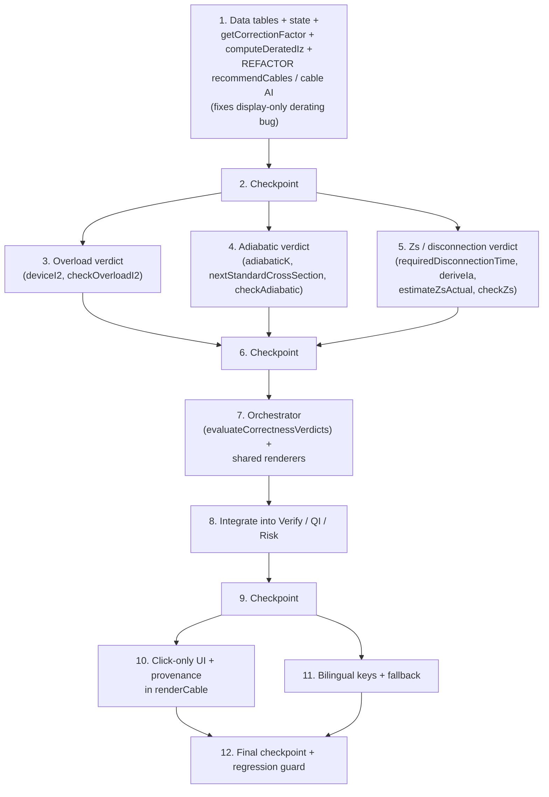

# Implementation Plan: Dimensioning Correctness Hardening

## Overview

This plan implements **Tier 1 Safety-Correctness Hardening** entirely inside the single existing file
`el-dimensionering.html`. **No new files, no separate apps, no subdirectories** are created. All new
logic is added to the existing `<script>` block as a self-contained **Correctness Engine** section,
new `const` data tables are added beside the existing tables, and the new UI is rendered through the
existing `renderModule(mod)` switch and bilingual `t()` mechanism.

The implementation language is **vanilla JavaScript**, matching the existing codebase (no build step,
framework, or module system is introduced).

The work is sequenced so the **highest-priority safety bug is fixed first**: derating is currently
display-only, so `recommendCables` and `runQiValidation` coordinate against the raw table ampacity.
Task 1 establishes the shared derating function and routes the auto-recommendation through it,
closing that gap before anything else. The three remaining verdicts (overload, adiabatic, Zs) are
then added incrementally, unified by a compute-once orchestrator, integrated into the Verify / QI /
Risk views, and finally surfaced through click-only bilingual UI with provenance.

Each task integrates into the **existing functions** named in the design
(`recommendCables`, `getAiAssistant('cable')`, `runQiValidation`, `runSelfTests` / `renderVerify`,
`renderCable`, `AUTO_RISK_RULES` / `autoPopulateRisks`, `renderModule`) and adds the new engine
functions and data tables. Property tests use `fast-check` (a dev-time dependency only — never bundled
into the HTML file; the engine is reached through a guarded test hook such as `window.__ENGINE__`).

## Task Dependency Graph

**Critical path:** 1 → 2 → (3, 4, 5) → 6 → 7 → 8 → 9 → (10, 11) → 12. Task 1 is foundational: it both
fixes the highest-priority bug and supplies `computeDeratedIz`, which the overload and orchestrator
tasks depend on. Tasks 3, 4, and 5 are independent of one another and may proceed in any order after
the first checkpoint. Tasks 10 and 11 are independent of each other after checkpoint 9.

## Tasks

- [ ] 1. Foundational data tables, state, and the derated-ampacity engine (highest-priority safety fix)
  - Add all new `const` data tables and new state beside the existing declarations, build the shared
    correction-factor resolver and derating function, then route the auto-recommendation through it so
    derating stops being display-only. This single task closes the root-cause "display-only derating"
    bug described in the design Overview.
  - All edits are within the existing `<script>` block of `el-dimensionering.html`.

  - [ ] 1.1 Add new data tables and verdict state
    - Add `const` tables next to the existing data tables: `K_ADIABATIC`, `STANDARD_CSA`,
      `SOIL_FACTORS`, `DISCONNECT_TIME`, `FUSE_0_4S`, `U0_NOMINAL` (230), `U_L_LIMIT` (50).
    - Add `let verdictState = { systemType:'TN', circuitCategory:'final', tClear:null, rcdIDn:0.3, soilResistivity:null }`.
    - Extend `cableState` with a `soil` field (display binding only).
    - Reuse existing tables unchanged (`IZ_*`, `INSTALL_METHODS`, `TEMP_FACTORS`, `GROUP_FACTORS`,
      `FUSE_5S`, `MCB_CURVES`, `MCCB_TRIPS`, `CABLES_*`, `PRODUCTS.*`).
    - _Requirements: 4.2, 4.4, 5.1, 5.5, 2.2, 6.5_

  - [ ] 1.2 Implement `getCorrectionFactor(category, key)` conservative resolver
    - Map `category` → table (`ca`→`TEMP_FACTORS`, `cg`→`GROUP_FACTORS`, `cs`→`SOIL_FACTORS`,
      `kInstall`→`INSTALL_METHODS`); return `{ value, defaulted, valid, source }`.
    - When `key` is absent/null, substitute the numerically lowest value `≤ 1.0` for that category
      (most reducing); for `cs` when not buried, return `{ value:1.0, defaulted:false }`.
    - _Requirements: 2.1, 2.2, 2.5_

  - [ ]* 1.3 Write property test for conservative correction-factor defaults
    - **Property 4: Conservative defaults never inflate capacity**
    - Tag: `// Feature: dimensioning-correctness-hardening, Property 4: Conservative defaults never inflate capacity`
    - Verify an unselected factor resolves to the lowest defined value (`≤ 1.0` and `≤` every
      selectable value) and that replacing any unselected factor with its largest selectable value
      never decreases `Derated_Iz`. Minimum 100 iterations via `fast-check`.
    - **Validates: Requirements 2.1, 2.2, 2.5**

  - [ ] 1.4 Implement `computeDeratedIz(...)` and `deratedIzForProduct(product, env)`
    - Resolve each factor via `getCorrectionFactor`; compute `totalFactor = ca×cg×cs×kInstall` and
      `deratedIz = Math.floor(baseIz × totalFactor × 100) / 100` (round **down** to 2 dp).
    - Apply the DD-5 validation guard: reject non-numeric factors, factors `< 0.01`, and **defaulted**
      factors `> 1.0` (return `{ ok:false, error:{factor, reason} }`); accept user-selected Annex B
      values `> 1.0` up to the documented ceiling (1.25).
    - Return `defaulted` flags for the UI conservative-default indicator.
    - `deratedIzForProduct` wraps `computeDeratedIz` using a product's `officialIz` base value and the
      active environment selections.
    - _Requirements: 1.4, 1.8, 2.3, 2.4_

  - [ ]* 1.5 Write property test for the derating formula and round-down
    - **Property 2: Derating formula and round-down**
    - Tag: `// Feature: dimensioning-correctness-hardening, Property 2: Derating formula and round-down`
    - Verify `Derated_Iz === floor(Base_Iz × Ca × Cg × Cs × k_install × 100)/100`, has at most two
      decimals, and is `≤` the exact unrounded product. Minimum 100 iterations.
    - **Validates: Requirements 1.4**

  - [ ]* 1.6 Write property test for derating monotonicity
    - **Property 3: Derating never increases capacity**
    - Tag: `// Feature: dimensioning-correctness-hardening, Property 3: Derating never increases capacity`
    - Verify that whenever the total correction factor is `≤ 1`, `Derated_Iz ≤ Base_Iz`. Minimum 100
      iterations.
    - **Validates: Requirements 1.4**

  - [ ] 1.7 Refactor `recommendCables` and the cable AI assistant to use derated capacity
    - Change `recommendCables(ib, material)` to filter candidates on
      `deratedIzForProduct(c, env) >= inMin` (where `inMin` is the smallest standard device rating
      `≥ IB`) instead of the raw `officialIz(c)`; exclude any conductor whose `Derated_Iz < In`.
    - When no candidate satisfies the condition, return an empty set and surface a "no compliant
      conductor" indication.
    - Replace the inline derating in `getAiAssistant('cable')` with a single call to
      `computeDeratedIz` (remove the duplicated derating math so there is one source of truth).
    - _Requirements: 1.1, 1.2, 1.3, 1.5, 1.9_

  - [ ]* 1.8 Write property test for derated-safe recommendations (regression guard)
    - **Property 1: Recommendations are derated-safe**
    - Tag: `// Feature: dimensioning-correctness-hardening, Property 1: Recommendations are derated-safe`
    - Verify every conductor returned by `recommendCables(IB)` has `Derated_Iz ≥ In`; that the set is
      empty when none qualifies; and that a conductor passing on `Base_Iz` but with `Derated_Iz < In`
      is excluded (display-only-bug regression guard). Minimum 100 iterations.
    - **Validates: Requirements 1.1, 1.5, 1.9**

- [ ] 2. Checkpoint - derating engine and recommendation fix
  - Ensure all tests pass, ask the user if questions arise.

- [ ] 3. Overload coordination verdict — I₂ ≤ 1,45 × Iz
  - Add the device-tripping-current helper and the overload check function to the Correctness Engine
    section. Both are pure functions returning the shared verdict shape
    `{ id, state, clause, values, message, recommendation }`.

  - [ ] 3.1 Implement `deviceI2(device)`
    - Return `{ i2, factor, defaulted }`: `1.6 × In` for a gG fuse, `1.45 × In` for an MCB/MCCB, and
      `1.6 × In` with `defaulted:true` for an unknown device kind (conservative).
    - _Requirements: 3.1, 3.5_

  - [ ]* 3.2 Write property test for I₂ computation by device type
    - **Property 5: I₂ computed by device type**
    - Tag: `// Feature: dimensioning-correctness-hardening, Property 5: I2 computed by device type`
    - Verify `I₂ = 1.6 × In` for gG fuse / unknown kind and `1.45 × In` for MCB/MCCB across random
      `In > 0`. Minimum 100 iterations.
    - **Validates: Requirements 3.1, 3.5**

  - [ ] 3.3 Implement `checkOverloadI2({ device, deratedIz })`
    - Return INSUFFICIENT_DATA when `device.inA` or `deratedIz` is missing, zero, or negative.
    - Otherwise compare `round2(i2) ≤ round2(1.45 × deratedIz)`: PASS on hold (incl. equality), else
      FAIL with a non-null recommendation (larger cross-section or lower-I₂ device).
    - Set `clause = 'DS/HD 60364-4-43 §433.1'` and populate `values` with `i2` and the `1.45 × Iz`
      limit (currents to 2 dp).
    - _Requirements: 3.2, 3.3, 3.4, 3.6, 3.7_

  - [ ]* 3.4 Write property test for overload verdict correctness
    - **Property 6: Overload verdict correctness**
    - Tag: `// Feature: dimensioning-correctness-hardening, Property 6: Overload verdict correctness`
    - Verify PASS iff `round2(I₂) ≤ round2(1.45 × Derated_Iz)` (equality passes) and FAIL otherwise
      carries a non-null recommendation, for valid `In, Derated_Iz > 0`. Minimum 100 iterations.
    - **Validates: Requirements 3.2, 3.3**

  - [ ]* 3.5 Write property test for overload independence (gG fuse)
    - **Property 7: Overload independence for gG fuses**
    - Tag: `// Feature: dimensioning-correctness-hardening, Property 7: Overload independence for gG fuses`
    - Generate inputs in the region where `In ≤ Derated_Iz` but `1.6 × In > 1.45 × Derated_Iz` and
      verify the verdict is FAIL. Minimum 100 iterations.
    - **Validates: Requirements 3.2, 3.3**

  - [ ]* 3.6 Write property test for overload equivalence (MCB/MCCB)
    - **Property 8: Overload equivalence for MCB/MCCB**
    - Tag: `// Feature: dimensioning-correctness-hardening, Property 8: Overload equivalence for MCB/MCCB`
    - Verify that for MCB/MCCB (`I₂ = 1.45 × In`) the overload verdict is PASS iff `In ≤ Derated_Iz`.
      Minimum 100 iterations.
    - **Validates: Requirements 3.1, 3.2**

- [ ] 4. Adiabatic short-circuit withstand verdict — k²·S² ≥ I²t
  - Add the adiabatic-constant lookup, the standard-cross-section selector, and the adiabatic check to
    the Correctness Engine section.

  - [ ] 4.1 Implement `adiabaticK(material, insulation)` and `nextStandardCrossSection(sMin)`
    - `adiabaticK` looks up `K_ADIABATIC` (Cu/PVC 115, Cu/XLPE 143, Al/PVC 76, Al/XLPE 94), returning
      `null` for undefined combinations; map insulation from cable type (`/NOIKLX|NOIKX|NOIK-AL|NOSP/i`
      → XLPE, otherwise PVC).
    - `nextStandardCrossSection` returns the smallest `STANDARD_CSA` value `≥ sMin`, or `null` if none.
    - _Requirements: 4.2, 4.4, 4.8_

  - [ ] 4.2 Implement `checkAdiabatic({ material, insulation, sArea, isc, tClear })`
    - Return INSUFFICIENT_DATA when `isc` or `tClear` is unknown, or when `k` is `null`.
    - Compute `i2t = isc² × tClear`, `withstand = k² × sArea²`, `sMin = √(i2t)/k`; PASS when
      `withstand ≥ i2t`, else FAIL recommending `nextStandardCrossSection(sMin)`; if none exists, FAIL
      with "no available cross-section meets withstand".
    - Set `clause = 'DS/HD 60364-4-43 §434.5.2'`; populate `values` with `k`, `i2t`, `withstand`,
      `sMin`, `sArea`.
    - _Requirements: 4.1, 4.3, 4.5, 4.6, 4.7, 4.9_

  - [ ]* 4.3 Write property test for adiabatic withstand correctness
    - **Property 9: Adiabatic withstand correctness**
    - Tag: `// Feature: dimensioning-correctness-hardening, Property 9: Adiabatic withstand correctness`
    - For material/insulation pairs with defined `k`, verify PASS iff `k² × S² ≥ Isc² × t_clear`.
      Minimum 100 iterations.
    - **Validates: Requirements 4.1, 4.2, 4.3**

  - [ ]* 4.4 Write property test for monotonicity in cross-section
    - **Property 10: Adiabatic verdict is monotonic in cross-section**
    - Tag: `// Feature: dimensioning-correctness-hardening, Property 10: Adiabatic verdict is monotonic in cross-section`
    - For fixed material, insulation, Isc, t_clear: if `S1 ≥ S2` and S2 yields PASS, S1 yields PASS.
      Minimum 100 iterations.
    - **Validates: Requirements 4.3**

  - [ ]* 4.5 Write property test for monotonicity in fault energy
    - **Property 11: Adiabatic verdict is monotonic in fault energy**
    - Tag: `// Feature: dimensioning-correctness-hardening, Property 11: Adiabatic verdict is monotonic in fault energy`
    - For a fixed conductor: as `I²t` increases, a PASS may become FAIL but a FAIL never becomes PASS.
      Minimum 100 iterations.
    - **Validates: Requirements 4.3**

  - [ ]* 4.6 Write property test for the adiabatic recommendation round-trip
    - **Property 12: Adiabatic recommendation round-trip**
    - Tag: `// Feature: dimensioning-correctness-hardening, Property 12: Adiabatic recommendation round-trip`
    - For any FAIL case where a standard cross-section is adequate, verify re-evaluating the
      recommended `S_min` rounded up to the next standard cross-section yields PASS
      (`k² × S_min² ≥ I²t`). Minimum 100 iterations.
    - **Validates: Requirements 4.4, 4.8**

- [ ] 5. Earth-fault-loop impedance / disconnection-time verdict — Zs ≤ Zs_max
  - Add the disconnection-time lookup, the Ia derivation, the Zs estimator, and the Zs check to the
    Correctness Engine section.

  - [ ] 5.1 Implement `requiredDisconnectionTime(systemType, circuitCategory, inA)`
    - Look up `DISCONNECT_TIME`: TN → 0.4 s for final with `In ≤ 32 A`, else 5 s; TT → 0.2 s for final
      with `In ≤ 32 A`, else 1 s.
    - _Requirements: 5.1_

  - [ ]* 5.2 Write property test for the disconnection-time lookup
    - **Property 13: Disconnection-time lookup**
    - Tag: `// Feature: dimensioning-correctness-hardening, Property 13: Disconnection-time lookup`
    - Verify the returned time matches the `DISCONNECT_TIME` matrix across all System_Type × circuit
      category × `In`-straddling-32 A combinations. Minimum 100 iterations.
    - **Validates: Requirements 5.1**

  - [ ] 5.3 Implement `deriveIa(device, reqTime)` and `estimateZsActual()`
    - `deriveIa`: MCB → `MCB_CURVES[curve].isdMax × In`; MCCB → `inVal × ioMult × isdMult × 1.1`;
      gG fuse → `FUSE_5S[size]` (5 s) or `FUSE_0_4S[size]` (0.4/0.2 s); unknown → `{ known:false }`.
    - `estimateZsActual`: derive loop impedance from `scState` and the selected cable r/x; return
      `{ zs, known }` with `known:false` when the impedance model is incomplete.
    - _Requirements: 5.2, 5.7, 5.9_

  - [ ] 5.4 Implement `checkZs({ systemType, circuitCategory, device, rcdIDn, u0 })`
    - TN: compute `Zs_max = U0/Ia`, evaluate `Zs ≤ Zs_max`, clause `DS/HD 60364-4-41 §411.4` (+ §411.3.2);
      FAIL recommends a faster-operating device.
    - TT: evaluate `Zs × IΔn ≤ U_L (50 V)`, clause `§411.5` (+ §411.3.2); FAIL recommends adding an RCD
      or lower IΔn.
    - INSUFFICIENT_DATA when Ia not derivable or actual Zs unknown; guard division by zero/negative Ia.
    - Populate `values` with `zsMax`, `zsActual`, `ia`, `reqTime`.
    - _Requirements: 5.3, 5.4, 5.5, 5.6, 5.8, 5.10_

  - [ ]* 5.5 Write property test for inverse monotonicity of Zs_max
    - **Property 14: Zs_max is inversely monotonic in Ia**
    - Tag: `// Feature: dimensioning-correctness-hardening, Property 14: Zs_max is inversely monotonic in Ia`
    - For fixed `U₀` and `Ia > 0`, verify `Zs_max = U₀/Ia` and a larger Ia yields a smaller `Zs_max`.
      Minimum 100 iterations.
    - **Validates: Requirements 5.3**

  - [ ]* 5.6 Write property test for Zs verdict correctness (TN and TT)
    - **Property 15: Zs verdict correctness for TN and TT**
    - Tag: `// Feature: dimensioning-correctness-hardening, Property 15: Zs verdict correctness for TN and TT`
    - Verify TN PASS iff `Zs ≤ Zs_max`, TT PASS iff `Zs × IΔn ≤ 50 V`, and every FAIL carries a
      non-null recommendation. Minimum 100 iterations.
    - **Validates: Requirements 5.4, 5.5, 5.6, 5.10**

- [ ] 6. Checkpoint - all four check functions implemented
  - Ensure all tests pass, ask the user if questions arise.

- [ ] 7. Compute-once orchestrator and shared verdict renderers
  - Add the single orchestrator that produces the immutable verdict bundle consumed identically by
    every view, plus the shared bilingual renderers.

  - [ ] 7.1 Implement `evaluateCorrectnessVerdicts()`
    - Read the relevant global state (`loadState`/`calcIB`, `cableState`+soil, `scState`,
      `mcb/mccb/fuseState`, `verdictState`), call the four checks, and return a frozen bundle
      `{ ampacity, overload, adiabatic, zs }`.
    - Wrap each check defensively so an unexpected error yields INSUFFICIENT_DATA for that verdict
      (never a thrown exception that blanks the screen).
    - _Requirements: 1.2, 1.3, 7.7, 9.2_

  - [ ] 7.2 Implement `renderVerdictRow(verdict)` and `renderVerdictInputs()`
    - `renderVerdictRow`: one bilingual row with a PASS/FAIL/INSUFFICIENT_DATA badge, governing clause,
      and computed values; distinguish FAIL/INSUFFICIENT_DATA with icon + text label, not color alone.
    - `renderVerdictInputs`: click-only controls for `verdictState` (System_Type, circuit category,
      t_clear, RCD IΔn, soil class) using `.sel-btn` / `.select-grid`, 44×44 px minimum targets, with
      conservative defaults pre-selected.
    - _Requirements: 9.1, 9.4, 6.1, 6.2, 6.3, 6.5, 6.6_

  - [ ]* 7.3 Write property test for the safety-provenance invariant
    - **Property 20: Safety-provenance invariant**
    - Tag: `// Feature: dimensioning-correctness-hardening, Property 20: Safety-provenance invariant`
    - For each of the four verdicts and any inputs (including missing/non-numeric fields), verify the
      verdict always carries a non-empty clause and that missing-input/unknown-clause cases produce
      INSUFFICIENT_DATA, never PASS. Minimum 100 iterations.
    - **Validates: Requirements 1.7, 3.6, 3.7, 4.6, 4.7, 4.9, 5.7, 5.8, 5.9, 9.1, 9.2, 9.5**

  - [ ]* 7.4 Write property test for the conservative tie-break
    - **Property 21: Conservative tie-break**
    - Tag: `// Feature: dimensioning-correctness-hardening, Property 21: Conservative tie-break`
    - For situations with two or more equally valid, unrankable candidates, verify the most
      conservative one is selected (larger cross-section, faster device, or added protective measure).
      Minimum 100 iterations.
    - **Validates: Requirements 9.3**

- [ ] 8. Integrate the four verdicts into the Verify module, QI index, and Risk matrix
  - Wire the orchestrator output into the three summary views so every verdict is visible and
    consistent. All three read the one bundle from `evaluateCorrectnessVerdicts()`.

  - [ ] 8.1 Extend `runQiValidation()` with the four verdicts as scored rules
    - Push `ampacity`, `overload`, `adiabatic`, and `zs` as scored rules whose displayed state is one
      of PASS / FAIL / INSUFFICIENT_DATA; map FAIL → `error` severity and INSUFFICIENT_DATA →
      `warning` severity (never counted as passing).
    - _Requirements: 7.2, 7.3, 7.4_

  - [ ]* 8.2 Write property test for QI severity mapping
    - **Property 16: QI severity mapping**
    - Tag: `// Feature: dimensioning-correctness-hardening, Property 16: QI severity mapping`
    - Verify FAIL → `error` and INSUFFICIENT_DATA → `warning` (never passing) for each verdict.
      Minimum 100 iterations.
    - **Validates: Requirements 7.3, 7.4**

  - [ ] 8.3 Extend `runSelfTests()` / `renderVerify()` with four self-tests and a verdict panel
    - Append one self-test per verdict that reads the bundle and reports the verdict's current
      PASS / FAIL / INSUFFICIENT_DATA state; render the verdict panel via `renderVerdictRow`.
    - Preserve all existing self-test reference cases unchanged.
    - _Requirements: 7.1_

  - [ ] 8.4 Refactor `AUTO_RISK_RULES` / `autoPopulateRisks()` to be verdict-driven
    - Make the shock/fire/earth rules read the verdict bundle: any FAIL or INSUFFICIENT_DATA verdict
      adds exactly one risk entry identifying the verdict, its state, and its governing clause; a PASS
      verdict removes the corresponding entry.
    - _Requirements: 7.5, 7.6_

  - [ ]* 8.5 Write property test for risk-entry presence and removal
    - **Property 17: Risk-entry presence and removal**
    - Tag: `// Feature: dimensioning-correctness-hardening, Property 17: Risk-entry presence and removal`
    - Verify FAIL/INSUFFICIENT_DATA produces exactly one referencing risk entry and PASS produces
      none, for each verdict. Minimum 100 iterations.
    - **Validates: Requirements 7.5, 7.6**

  - [ ]* 8.6 Write property test for cross-view consistency
    - **Property 18: Cross-view consistency (single source of truth)**
    - Tag: `// Feature: dimensioning-correctness-hardening, Property 18: Cross-view consistency`
    - Verify that for any inputs, the state reported by the Verify module, QI index, and Risk matrix is
      identical for each of the four verdicts. Minimum 100 iterations.
    - **Validates: Requirements 1.2, 1.3, 7.1, 7.2, 7.7**

- [ ] 9. Checkpoint - verdicts integrated across all summary views
  - Ensure all tests pass, ask the user if questions arise.

- [x] 10. Click-only verdict inputs, provenance cards, and derating display in `renderCable`
  - Surface the new inputs and verdict/provenance output inside the existing Cable module render path.

  - [x] 10.1 Wire verdict inputs, verdict/provenance cards, and derating display into `renderCable()`
    - Call `renderVerdictInputs()` and render the four `renderVerdictRow` cards (each with its clause).
    - Display `Base_Iz` and `Derated_Iz` to 2 dp and the total correction factor (Ca×Cg×Cs×k_install)
      to 3 dp.
    - Show the persistent conservative-default indicator beside any defaulted factor; remove it and
      recompute when the user selects a value; on an invalid factor, keep the previous ampacity verdict
      and show an error naming the offending factor.
    - _Requirements: 1.6, 1.7, 1.8, 2.3, 2.4, 9.1, 9.4_

  - [x]* 10.2 Write unit tests for click-only controls
    - Assert the new screens render exactly the finite option sets, contain no `input[type=text]` /
      `textarea` / keyboard-entry control, and use 44×44 px minimum touch targets; assert each control
      pre-selects its most restrictive (safest) option.
    - _Requirements: 6.1, 6.2, 6.3, 6.4, 6.6_

  - [x]* 10.3 Write property test for click-only, conservatively-defaulted verdict screens
    - **Property 22: Click-only, conservatively-defaulted verdict screens**
    - Tag: `// Feature: dimensioning-correctness-hardening, Property 22: Click-only conservatively-defaulted verdict screens`
    - Verify the rendered markup for any verdict screen contains no free-text/keyboard-entry control
      and that each new control's pre-selected value equals the most restrictive option, so a valid
      verdict is computable from defaults alone. Minimum 100 iterations.
    - **Validates: Requirements 6.4, 6.5**

- [x] 11. Bilingual translation keys and Danish fallback for all new content
  - Add Danish-primary and English keys for every new label, verdict, and recommendation in the
    existing `T = { da, en }` translations, reusing the existing neon dark-mode theme classes.

  - [x] 11.1 Add new translation keys and Danish fallback
    - Add `da` and `en` entries for all new controls, labels, verdict states, clauses, and
      recommendations; ensure the `t()` resolver returns the Danish text when an English entry is
      missing (no blank value or raw key) and that English re-render preserves entered state.
    - Apply the existing neon dark-mode classes so new elements are styling-indistinguishable from
      existing-module elements.
    - _Requirements: 8.1, 8.2, 8.3, 8.4, 8.5_

  - [x]* 11.2 Write property test for bilingual completeness and fallback
    - **Property 19: Bilingual completeness and fallback**
    - Tag: `// Feature: dimensioning-correctness-hardening, Property 19: Bilingual completeness and fallback`
    - For every new key and both languages, verify the resolved label is non-empty and not the raw
      key, and that a missing English translation falls back to Danish. Minimum 100 iterations.
    - **Validates: Requirements 8.4, 8.5**

  - [x]* 11.3 Write unit tests for the bilingual toggle and theme consistency
    - Assert Danish is the default, the English toggle re-renders on-screen content within 1 second
      without reload or data loss, and new elements use the same theme classes as existing modules.
    - _Requirements: 8.1, 8.2, 8.3_

- [x] 12. Final checkpoint - regression guard and full suite
  - [x] 12.1 Add the display-only-bug regression test and confirm existing self-tests pass
    - Add an example reproducing the original defect (a conductor passing on `Base_Iz` but failing on
      `Derated_Iz`) and assert it now produces FAIL in `recommendCables`, QI, Verify, and Risk.
    - Confirm the existing `runSelfTests` reference cases (IB, official Iz, transformer Ik, MCB Isd,
      voltage drop, c-factor) still pass.
    - _Requirements: 1.1, 1.5, 7.1, 7.7_

  - [x] 12.2 Final checkpoint
    - Ensure all tests pass, ask the user if questions arise.

## Notes

- All work targets the single file `el-dimensionering.html` — no new files, apps, or subdirectories.
- Tasks marked with `*` are optional property/unit tests and can be skipped for a faster MVP; the 22
  property tests map one-to-one to the design's 22 correctness properties.
- `fast-check` is a dev-time dependency only and is never bundled into the HTML; the engine functions
  are reached through a guarded test hook (e.g. `window.__ENGINE__`).
- Each property test runs a minimum of 100 generated cases and is tagged
  `// Feature: dimensioning-correctness-hardening, Property {n}: {text}`.
- Task 1 fixes the highest-priority safety bug (display-only derating) before any new verdict is added.
- Conservatism is preserved throughout: unknown inputs default to the worst case and produce
  INSUFFICIENT_DATA rather than PASS, and every verdict cites its governing DS/HD 60364 clause.
- Checkpoints (Tasks 2, 6, 9, 12) provide incremental validation after each major milestone.
