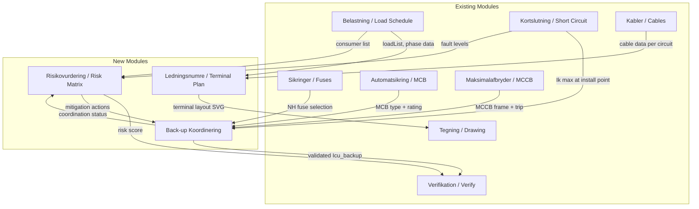
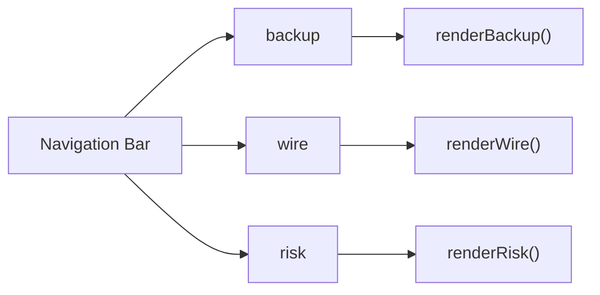
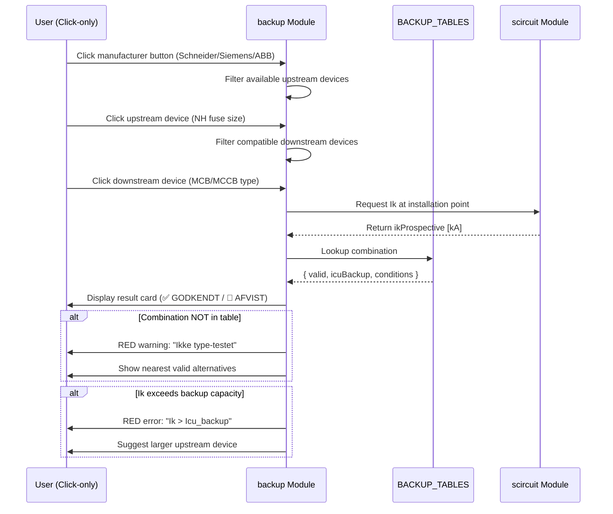
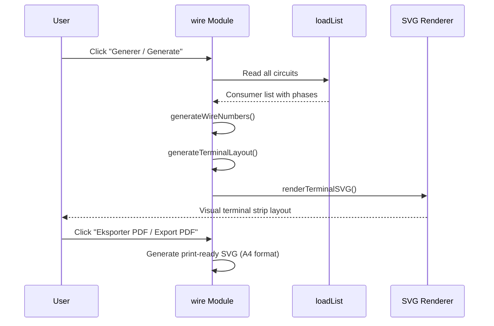
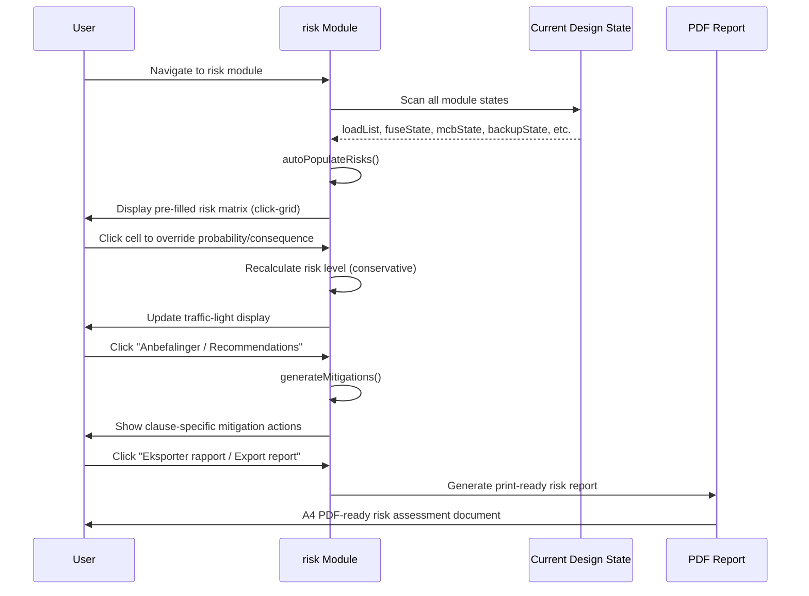
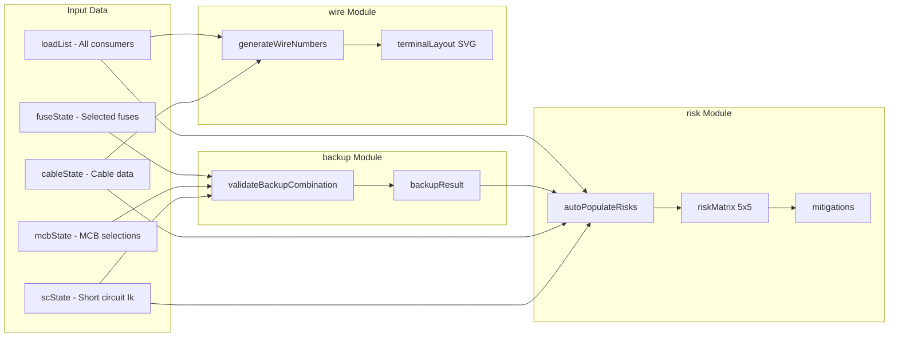

# Design Document: Manufacturer Back-up, Wire Numbering & Risk Matrix

## Overview

This design covers three life-safety-critical features for the El-Dimensionering app, expanding the existing 16-module architecture with three new modules: **backup** (manufacturer back-up protection coordination), **wire** (wire numbering and terminal plans), and **risk** (installation risk matrix). All three integrate with the existing load schedule, fuse/MCB/MCCB data, cable calculations, and short-circuit verification to provide a complete safety documentation chain per Danish regulatory requirements.

The features are designed with the app's fundamental principles: 100% click-only interaction (zero typing), conservative safety defaults (always err on side of over-protection), bilingual Danish/English with Danish primary, and compliance with DS/HD 60364 series as primary standard with Sikkerhedsstyrelsen.dk as regulatory authority.

All manufacturer data is sourced from tested/certified combination tables only — the app will NEVER interpolate or extrapolate back-up combinations that have not been physically tested and documented by the manufacturer.

## Architecture

### System Integration Overview



### Module Registration



New module cases added to `renderModule()`:
- `case 'backup': content = renderBackup(); break;`
- `case 'wire': content = renderWire(); break;`
- `case 'risk': content = renderRisk(); break;`

---

## Component 1: Manufacturer Back-up Protection (backup)

### Purpose

Validates back-up protection coordination per DS/HD 60364-4-43 clause 434.3.1 and IEC 60947-2 Annex A. When a downstream protective device (MCB or MCCB) has insufficient breaking capacity (Icu) for the prospective short-circuit current (Ik) at its installation point, an upstream device (typically NH fuse) can "back up" the downstream device — but ONLY if the specific combination has been tested and certified by the manufacturer.

### Reference Standards

- **DS/HD 60364-4-43:2023** — clause 434.3.1 (back-up protection requirements)
- **IEC 60947-2 Annex A** — type-tested back-up combinations and conditional short-circuit current
- **Sikkerhedsstyrelsen** — regulatory enforcement authority

### Interface

```javascript
// Back-up module state
let backupState = {
  manufacturer: null,        // 'schneider' | 'siemens' | 'abb'
  upstreamType: null,        // 'nh_fuse' | 'mccb'
  upstreamDevice: null,      // e.g. 'NH1-200A' or 'NSX400-N'
  downstreamType: null,      // 'mcb' | 'mccb'
  downstreamDevice: null,    // e.g. 'C60N-C32' or 'NSX100-F'
  downstreamRating: null,    // In [A]
  ikAtPoint: null,           // Prospective Ik [kA] at installation point
  validatedResult: null      // { valid, icuBackup, source, warning }
};

// Render function
function renderBackup() { /* returns HTML string */ }

// Validation function — the CORE safety logic
function validateBackupCombination(manufacturer, upstream, downstream, ik) {
  // Returns: { valid: boolean, icuBackup: number|null, 
  //            source: string, warning: string|null }
}
```

### Data Model: Manufacturer Back-up Tables

```javascript
// CRITICAL: These tables contain ONLY manufacturer-tested combinations.
// NEVER interpolate. NEVER extrapolate. If combination not in table → REJECT.

const BACKUP_TABLES = {
  schneider: {
    name: 'Schneider Electric',
    source: 'Schneider back-up tables (SENTRON catalogue)',
    // upstream_key → downstream_key → { icuBackup [kA], maxIn [A], conditions }
    combinations: {
      'NH1-200A-gG': {
        'C60N-C': { icuBackup: 20, maxIn: 63, conditions: 'Ik ≤ 20 kA' },
        'C60N-B': { icuBackup: 20, maxIn: 63, conditions: 'Ik ≤ 20 kA' },
        'C60H-C': { icuBackup: 25, maxIn: 63, conditions: 'Ik ≤ 25 kA' },
        'C60H-B': { icuBackup: 25, maxIn: 63, conditions: 'Ik ≤ 25 kA' },
        'C120N-C': { icuBackup: 20, maxIn: 125, conditions: 'Ik ≤ 20 kA' },
        'NSX100-F': { icuBackup: 36, maxIn: 100, conditions: 'Ik ≤ 36 kA' },
        'NSX100-N': { icuBackup: 50, maxIn: 100, conditions: 'Ik ≤ 50 kA' },
        'NSX160-N': { icuBackup: 50, maxIn: 160, conditions: 'Ik ≤ 50 kA' }
      },
      'NH1-250A-gG': {
        'C60N-C': { icuBackup: 25, maxIn: 63, conditions: 'Ik ≤ 25 kA' },
        'C60H-C': { icuBackup: 30, maxIn: 63, conditions: 'Ik ≤ 30 kA' },
        'NSX100-N': { icuBackup: 50, maxIn: 100, conditions: 'Ik ≤ 50 kA' },
        'NSX160-N': { icuBackup: 50, maxIn: 160, conditions: 'Ik ≤ 50 kA' },
        'NSX250-N': { icuBackup: 50, maxIn: 250, conditions: 'Ik ≤ 50 kA' }
      },
      'NH2-315A-gG': {
        'NSX100-N': { icuBackup: 50, maxIn: 100, conditions: 'Ik ≤ 50 kA' },
        'NSX160-N': { icuBackup: 50, maxIn: 160, conditions: 'Ik ≤ 50 kA' },
        'NSX250-N': { icuBackup: 50, maxIn: 250, conditions: 'Ik ≤ 50 kA' },
        'NSX400-N': { icuBackup: 50, maxIn: 400, conditions: 'Ik ≤ 50 kA' }
      },
      'NH2-400A-gG': {
        'NSX250-N': { icuBackup: 50, maxIn: 250, conditions: 'Ik ≤ 50 kA' },
        'NSX400-N': { icuBackup: 50, maxIn: 400, conditions: 'Ik ≤ 50 kA' },
        'NSX630-N': { icuBackup: 50, maxIn: 630, conditions: 'Ik ≤ 50 kA' }
      }
    }
  },
  
  siemens: {
    name: 'Siemens',
    source: 'Siemens beta katalog 2008 / SENTRON 5SY back-up tables',
    combinations: {
      'NH000-100A-gG': {
        '5SY-B': { icuBackup: 15, maxIn: 63, conditions: 'Ik ≤ 15 kA, 3p' },
        '5SY-C': { icuBackup: 15, maxIn: 63, conditions: 'Ik ≤ 15 kA, 3p' },
        '5SL-B': { icuBackup: 10, maxIn: 63, conditions: 'Ik ≤ 10 kA' },
        '5SL-C': { icuBackup: 10, maxIn: 63, conditions: 'Ik ≤ 10 kA' }
      },
      'NH000-160A-gG': {
        '5SY-B': { icuBackup: 20, maxIn: 63, conditions: 'Ik ≤ 20 kA, 3p' },
        '5SY-C': { icuBackup: 20, maxIn: 63, conditions: 'Ik ≤ 20 kA, 3p' },
        '5SL-B': { icuBackup: 15, maxIn: 63, conditions: 'Ik ≤ 15 kA' },
        '5SL-C': { icuBackup: 15, maxIn: 63, conditions: 'Ik ≤ 15 kA' }
      },
      'NH1-250A-gG': {
        '5SY-B': { icuBackup: 25, maxIn: 63, conditions: 'Ik ≤ 25 kA, 3p' },
        '5SY-C': { icuBackup: 25, maxIn: 63, conditions: 'Ik ≤ 25 kA, 3p' },
        '3VA1-N': { icuBackup: 25, maxIn: 160, conditions: 'Ik ≤ 25 kA' }
      },
      'NH2-400A-gG': {
        '3VA1-N': { icuBackup: 36, maxIn: 160, conditions: 'Ik ≤ 36 kA' },
        '3VA2-M': { icuBackup: 55, maxIn: 250, conditions: 'Ik ≤ 55 kA' }
      }
    }
  },
  
  abb: {
    name: 'ABB',
    source: 'ABB S200 + OFAF NH back-up coordination tables',
    combinations: {
      'NH000-100A-gG': {
        'S200-B': { icuBackup: 15, maxIn: 63, conditions: 'Ik ≤ 15 kA' },
        'S200-C': { icuBackup: 15, maxIn: 63, conditions: 'Ik ≤ 15 kA' },
        'S200M-B': { icuBackup: 15, maxIn: 63, conditions: 'Ik ≤ 15 kA' },
        'S200M-C': { icuBackup: 15, maxIn: 63, conditions: 'Ik ≤ 15 kA' }
      },
      'NH000-160A-gG': {
        'S200-B': { icuBackup: 20, maxIn: 63, conditions: 'Ik ≤ 20 kA' },
        'S200-C': { icuBackup: 20, maxIn: 63, conditions: 'Ik ≤ 20 kA' },
        'S200M-B': { icuBackup: 20, maxIn: 63, conditions: 'Ik ≤ 20 kA' },
        'S200M-C': { icuBackup: 20, maxIn: 63, conditions: 'Ik ≤ 20 kA' }
      },
      'NH1-250A-gG': {
        'S200-B': { icuBackup: 25, maxIn: 63, conditions: 'Ik ≤ 25 kA' },
        'S200-C': { icuBackup: 25, maxIn: 63, conditions: 'Ik ≤ 25 kA' },
        'S800N': { icuBackup: 36, maxIn: 125, conditions: 'Ik ≤ 36 kA' }
      },
      'NH2-400A-gG': {
        'S800N': { icuBackup: 50, maxIn: 125, conditions: 'Ik ≤ 50 kA' },
        'S800S': { icuBackup: 50, maxIn: 125, conditions: 'Ik ≤ 50 kA' },
        'Tmax-T4-N': { icuBackup: 36, maxIn: 250, conditions: 'Ik ≤ 36 kA' }
      }
    }
  }
};
```

### Safety Validation Logic

```javascript
function validateBackupCombination(manufacturer, upstreamKey, downstreamKey, ikProspective) {
  // SAFETY RULE 1: Manufacturer must be explicitly selected
  if (!manufacturer || !BACKUP_TABLES[manufacturer]) {
    return { valid: false, icuBackup: null, 
             source: null, 
             warning: '⚠️ ADVARSEL: Vælg producent / Select manufacturer' };
  }
  
  const mfr = BACKUP_TABLES[manufacturer];
  const combos = mfr.combinations[upstreamKey];
  
  // SAFETY RULE 2: Upstream device must exist in table
  if (!combos) {
    return { valid: false, icuBackup: null, 
             source: mfr.source,
             warning: '🚫 AFVIST: Opstrømsenheden findes ikke i ' + mfr.name + ' back-up tabel / Upstream device not in tested table' };
  }
  
  const entry = combos[downstreamKey];
  
  // SAFETY RULE 3: Specific combination must be type-tested
  // THIS IS THE CRITICAL SAFETY CHECK — NO INTERPOLATION ALLOWED
  if (!entry) {
    return { valid: false, icuBackup: null,
             source: mfr.source,
             warning: '🚫 AFVIST: Kombinationen er IKKE type-testet af ' + mfr.name + '. Brug KUN verificerede kombinationer per IEC 60947-2 Annex A. / Combination NOT type-tested. Use ONLY verified combinations per IEC 60947-2 Annex A.' };
  }
  
  // SAFETY RULE 4: Prospective Ik must not exceed back-up rated capacity
  if (ikProspective > entry.icuBackup) {
    return { valid: false, icuBackup: entry.icuBackup,
             source: mfr.source,
             warning: '🚫 FEJL: Ik (' + ikProspective + ' kA) > Icu_backup (' + entry.icuBackup + ' kA). Installation er IKKE sikker. / Ik exceeds back-up rated capacity. Installation is NOT safe.' };
  }
  
  // SAFETY RULE 5: Conservative pass — apply 10% safety margin
  const safeIk = entry.icuBackup * 0.9; // 10% conservative margin
  if (ikProspective > safeIk) {
    return { valid: true, icuBackup: entry.icuBackup,
             source: mfr.source,
             warning: '⚠️ BEMÆRK: Ik er tæt på grænsen (' + ikProspective + ' / ' + entry.icuBackup + ' kA). Overvej større opstrømssikring. / Ik is close to limit. Consider larger upstream device.' };
  }
  
  // Valid combination with comfortable margin
  return { valid: true, icuBackup: entry.icuBackup,
           source: mfr.source,
           warning: null };
}
```

### User Interaction Flow



### Responsibilities

- Display ONLY manufacturer-certified back-up combinations
- REJECT any combination not explicitly in the tested table
- Never calculate or estimate back-up Icu — use table values only
- Show clear ✅/🚫 status with Danish + English explanations
- Integrate with short-circuit module for automatic Ik comparison
- Provide one-click access to nearest valid alternative when rejected
- Log validation result to project documentation chain

---

## Component 2: Wire Numbering / Terminal Plans (wire)

### Purpose

Auto-generates wire numbers and terminal strip layouts from the load schedule following Danish conventions per DS/HD 60364-5-51 clause 514.5 (conductor identification), DS/EN 81346-2 (designation of objects in installations), and IEC 60204-1 (industrial machine wiring conventions). Produces print-ready SVG terminal plans for panel documentation.

### Reference Standards

- **DS/HD 60364-5-51:2022** — clause 514.5 (identification of conductors)
- **DS/EN 81346-2** — structured designation of objects
- **IEC 60204-1** — wire numbering conventions for industrial installations
- **Danish color convention**: PE = green/yellow, N = blue, L1 = brown, L2 = black, L3 = grey

### Interface

```javascript
// Wire numbering state
let wireState = {
  panelName: 'HT',           // Selected via click: HT, UT, GT, etc.
  numberingScheme: 'danish',  // 'danish' | 'iec60204'
  terminalMfr: 'phoenix',    // 'phoenix' | 'weidmuller' | 'wago'
  circuits: [],              // Auto-populated from loadList
  terminalStrips: [],        // Generated terminal strip layout
  wireList: [],              // Generated wire number list
  exportFormat: 'svg'        // 'svg' | 'pdf-ready'
};

// Render function
function renderWire() { /* returns HTML string */ }

// Core generation functions
function generateWireNumbers(loadList, panelName, scheme) { /* ... */ }
function generateTerminalLayout(wireList, manufacturer) { /* ... */ }
function renderTerminalSVG(terminalStrips) { /* returns SVG string */ }
```

### Data Model: Wire Numbering

```javascript
// Wire number object
// Format: [Panel]-[Circuit]-[Conductor]
// Example: "HT-K1-L1", "HT-K1-PE", "HT-K1-N"

const WIRE_SCHEME = {
  danish: {
    // Standard Danish panel designations (click-selectable)
    panels: ['HT', 'UT', 'GT', 'FT', 'LT', 'ST'],
    panelNames: {
      'HT': 'Hovedtavle',
      'UT': 'Undertavle',
      'GT': 'Gruppetavle', 
      'FT': 'Fordelingstavle',
      'LT': 'Lystavle',
      'ST': 'Styretavle'
    },
    // Circuit prefix
    circuitPrefix: 'K',  // Kreds (circuit)
    // Conductor suffixes per DS/HD 60364-5-51 clause 514.5
    conductors3phase: ['L1', 'L2', 'L3', 'N', 'PE'],
    conductors1phase: ['L', 'N', 'PE'],
    // Wire color coding (Danish standard)
    colors: {
      'L1': { color: '#8B4513', name: 'Brun / Brown', hex: '#8B4513' },
      'L2': { color: '#000000', name: 'Sort / Black', hex: '#1a1a1a' },
      'L3': { color: '#808080', name: 'Grå / Grey', hex: '#808080' },
      'L':  { color: '#8B4513', name: 'Brun / Brown', hex: '#8B4513' },
      'N':  { color: '#0066CC', name: 'Blå / Blue', hex: '#0066CC' },
      'PE': { color: '#228B22', name: 'Grøn/Gul / Green-Yellow', hex: '#228B22', stripe: '#FFD700' }
    }
  },
  iec60204: {
    // IEC 60204-1 machine wiring convention
    panels: ['=M1', '=M2', '=E1', '=E2'],
    panelNames: {
      '=M1': 'Machine Panel 1',
      '=M2': 'Machine Panel 2',
      '=E1': 'Electrical Cabinet 1',
      '=E2': 'Electrical Cabinet 2'
    },
    circuitPrefix: '-W',
    conductors3phase: ['L1', 'L2', 'L3', 'N', 'PE'],
    conductors1phase: ['L', 'N', 'PE'],
    colors: {
      'L1': { color: '#8B4513', name: 'Brown', hex: '#8B4513' },
      'L2': { color: '#000000', name: 'Black', hex: '#1a1a1a' },
      'L3': { color: '#808080', name: 'Grey', hex: '#808080' },
      'L':  { color: '#8B4513', name: 'Brown', hex: '#8B4513' },
      'N':  { color: '#0066CC', name: 'Blue', hex: '#0066CC' },
      'PE': { color: '#228B22', name: 'Green-Yellow', hex: '#228B22', stripe: '#FFD700' }
    }
  }
};

// Terminal manufacturer data
const TERMINAL_MANUFACTURERS = {
  phoenix: {
    name: 'Phoenix Contact CLIPLINE',
    types: {
      'UT-4':    { width: 6.2, maxA: 32, maxMM2: 4, color: '#aaa' },
      'UT-6':    { width: 8.2, maxA: 41, maxMM2: 6, color: '#aaa' },
      'UT-10':   { width: 10.2, maxA: 57, maxMM2: 10, color: '#aaa' },
      'UT-16':   { width: 12.2, maxA: 76, maxMM2: 16, color: '#aaa' },
      'UT-35':   { width: 16.2, maxA: 125, maxMM2: 35, color: '#aaa' },
      'USLKG-5': { width: 6.2, maxA: 32, maxMM2: 4, color: '#228B22', type: 'PE' },
      'USLKG-10':{ width: 10.2, maxA: 57, maxMM2: 10, color: '#228B22', type: 'PE' },
      'UKN':     { width: 6.2, maxA: 32, maxMM2: 4, color: '#0066CC', type: 'N' }
    }
  },
  weidmuller: {
    name: 'Weidmüller',
    types: {
      'WDU-4':   { width: 6.1, maxA: 32, maxMM2: 4, color: '#aaa' },
      'WDU-6':   { width: 8.1, maxA: 41, maxMM2: 6, color: '#aaa' },
      'WDU-10':  { width: 10.1, maxA: 57, maxMM2: 10, color: '#aaa' },
      'WDU-16':  { width: 12.1, maxA: 76, maxMM2: 16, color: '#aaa' },
      'WDU-35':  { width: 16.1, maxA: 125, maxMM2: 35, color: '#aaa' },
      'WPE-4':   { width: 6.1, maxA: 32, maxMM2: 4, color: '#228B22', type: 'PE' },
      'WPE-10':  { width: 10.1, maxA: 57, maxMM2: 10, color: '#228B22', type: 'PE' }
    }
  },
  wago: {
    name: 'Wago TopJob S',
    types: {
      '2002-1201': { width: 5.2, maxA: 24, maxMM2: 2.5, color: '#aaa' },
      '2002-1301': { width: 5.2, maxA: 32, maxMM2: 4, color: '#aaa' },
      '2006-1201': { width: 7.5, maxA: 41, maxMM2: 6, color: '#aaa' },
      '2010-1201': { width: 10, maxA: 57, maxMM2: 10, color: '#aaa' },
      '2016-1201': { width: 12, maxA: 76, maxMM2: 16, color: '#aaa' },
      '2002-1207': { width: 5.2, maxA: 24, maxMM2: 2.5, color: '#228B22', type: 'PE' },
      '2002-1204': { width: 5.2, maxA: 24, maxMM2: 2.5, color: '#0066CC', type: 'N' }
    }
  }
};
```

### Wire Number Generation Algorithm

```javascript
// Generates wire numbers from load schedule
function generateWireNumbers(loadList, panelName, scheme) {
  const config = WIRE_SCHEME[scheme];
  const wires = [];
  
  loadList.forEach((consumer, idx) => {
    const circuitNum = idx + 1;
    const circuitId = panelName + '-' + config.circuitPrefix + circuitNum;
    
    const conductors = consumer.phase === '3' 
      ? config.conductors3phase 
      : config.conductors1phase;
    
    conductors.forEach(cond => {
      wires.push({
        wireNumber: circuitId + '-' + cond,
        circuit: circuitId,
        conductor: cond,
        color: config.colors[cond],
        crossSection: selectCrossSection(consumer), // from cable module
        terminalFrom: panelName + ':X' + circuitNum + ':' + cond,
        terminalTo: circuitId + ':load'
      });
    });
  });
  
  return wires;
}

// Auto-select terminal type based on cable cross-section
function selectTerminal(mm2, conductor, manufacturer) {
  const mfr = TERMINAL_MANUFACTURERS[manufacturer];
  const isPE = conductor === 'PE';
  const isN = conductor === 'N';
  
  // Find smallest terminal that fits the cross-section
  // SAFETY: always select terminal >= cable cross-section
  const candidates = Object.entries(mfr.types)
    .filter(([key, t]) => {
      if (isPE && t.type !== 'PE') return false;
      if (isN && t.type === 'PE') return false;
      if (!isPE && !isN && t.type) return false;
      return t.maxMM2 >= mm2;
    })
    .sort((a, b) => a[1].maxMM2 - b[1].maxMM2);
  
  // Conservative: pick the first (smallest adequate) terminal
  return candidates.length > 0 ? candidates[0] : null;
}
```

### Terminal Strip SVG Generation



### Responsibilities

- Auto-generate wire numbers from existing load schedule (zero manual entry)
- Follow Danish conductor color coding exactly
- Support both Danish (HT-K1-L1) and IEC 60204-1 (=M1-W1-L1) schemes
- Visual click-selectable terminal blocks with correct colors
- Auto-select appropriate terminal size (conservative — never undersized)
- Generate print-ready SVG at A4 dimensions
- PE always green/yellow, N always blue — no exceptions
- Support 1-phase and 3-phase circuits from load schedule

---

## Component 3: Installation Risk Matrix (risk)

### Purpose

Provides a structured risk assessment matrix per Elsikkerhedsloven, DS/HD 60364-1 §131 (risk assessment methodology), and Arbejdstilsynet.dk workplace safety requirements. Auto-populates risk entries from current design choices and provides mitigation recommendations citing specific DS/HD 60364 clauses.

### Reference Standards

- **DS/HD 60364-1:2025** — §131 risk assessment methodology
- **Elsikkerhedsloven** — LBK nr 26 af 2023
- **Arbejdstilsynet.dk** — workplace electrical safety requirements
- **DS/HD 60364-4-41** — protection against electric shock
- **DS/HD 60364-4-42** — protection against thermal effects (fire)
- **DS/HD 60364-4-43** — protection against overcurrent
- **DS/HD 60364-4-44** — protection against electromagnetic disturbances

### Interface

```javascript
// Risk matrix state
let riskState = {
  assessmentDate: null,        // Auto-set to current date
  installation: {
    type: null,                // 'bolig' | 'erhverv' | 'industri' | 'landbrug'
    environment: null,         // 'indoor_dry' | 'indoor_wet' | 'outdoor' | 'hazardous'
    occupants: null            // 'general' | 'children' | 'elderly' | 'trained'
  },
  risks: [],                   // Auto-populated RiskEntry[]
  overrides: {},               // Manual probability/consequence overrides
  mitigations: []              // Applied mitigation measures
};

// Risk entry structure
// { id, category, description, probability, consequence, 
//   riskLevel, autoDetected, clause, mitigation }

function renderRisk() { /* returns HTML string */ }
function autoPopulateRisks() { /* analyze current design */ }
function calculateRiskLevel(probability, consequence) { /* 5×5 matrix */ }
function generateMitigations(risks) { /* DS/HD 60364 clause recommendations */ }
```

### Data Model: Risk Categories and Matrix

```javascript
// Risk categories per DS/HD 60364-1 §131
const RISK_CATEGORIES = {
  electric_shock: {
    da: 'Elektrisk stød',
    en: 'Electric Shock',
    icon: '⚡',
    clause: 'DS/HD 60364-4-41',
    subcategories: ['direct_contact', 'indirect_contact', 'residual_voltage']
  },
  fire: {
    da: 'Brand',
    en: 'Fire',
    icon: '🔥',
    clause: 'DS/HD 60364-4-42',
    subcategories: ['overload_ignition', 'arc_fault', 'poor_connection', 'cable_routing']
  },
  overcurrent: {
    da: 'Overstrøm',
    en: 'Overcurrent',
    icon: '📈',
    clause: 'DS/HD 60364-4-43',
    subcategories: ['overload', 'short_circuit', 'backup_inadequate']
  },
  overvoltage: {
    da: 'Overspænding',
    en: 'Overvoltage',
    icon: '⚠️',
    clause: 'DS/HD 60364-4-44',
    subcategories: ['lightning', 'switching_transient', 'neutral_loss']
  },
  electromagnetic: {
    da: 'Elektromagnetisk forstyrrelse',
    en: 'Electromagnetic Disturbance',
    icon: '📡',
    clause: 'DS/HD 60364-4-44',
    subcategories: ['harmonic_distortion', 'voltage_fluctuation', 'emc_emission']
  },
  earth_fault: {
    da: 'Jordfejl',
    en: 'Earth Fault',
    icon: '🌍',
    clause: 'DS/HD 60364-5-54',
    subcategories: ['missing_rcd', 'high_loop_impedance', 'tn_vs_tt_mismatch']
  }
};

// 5×5 Risk Matrix
// Probability: 1=Meget sjælden, 2=Sjælden, 3=Mulig, 4=Sandsynlig, 5=Meget sandsynlig
// Consequence: 1=Ubetydelig, 2=Mindre, 3=Moderat, 4=Alvorlig, 5=Katastrofal

const PROBABILITY_LABELS = {
  da: ['Meget sjælden', 'Sjælden', 'Mulig', 'Sandsynlig', 'Meget sandsynlig'],
  en: ['Very Rare', 'Rare', 'Possible', 'Probable', 'Very Probable']
};

const CONSEQUENCE_LABELS = {
  da: ['Ubetydelig', 'Mindre', 'Moderat', 'Alvorlig', 'Katastrofal'],
  en: ['Insignificant', 'Minor', 'Moderate', 'Serious', 'Catastrophic']
};

// Risk level matrix (consequence × probability → level)
// CONSERVATIVE: anything ambiguous rounds UP to worse level
const RISK_MATRIX = [
  // P1    P2    P3    P4    P5       ← Probability
  ['green','green','green','yellow','yellow'],  // C1 (Insignificant)
  ['green','green','yellow','yellow','red'],    // C2 (Minor)
  ['green','yellow','yellow','red','red'],      // C3 (Moderate)
  ['yellow','yellow','red','red','red'],        // C4 (Serious)
  ['yellow','red','red','red','red']            // C5 (Catastrophic)
];

const RISK_LEVELS = {
  green:  { da: 'Acceptabel', en: 'Acceptable', action: 'none', color: '#06d6a0' },
  yellow: { da: 'Reducér risiko', en: 'Mitigate', action: 'mitigate', color: '#ffd166' },
  red:    { da: 'Uacceptabel - SKAL rettes', en: 'Unacceptable - MUST fix', action: 'mandatory', color: '#ef476f' }
};
```

### Auto-Population Rules

```javascript
// SAFETY-CRITICAL: Auto-detect risks from current design state
// Always defaults to HIGHER risk when uncertain (conservative)

const AUTO_RISK_RULES = [
  {
    id: 'shock_no_rcd',
    category: 'electric_shock',
    condition: () => {
      // Check if any circuit in loadList lacks RCD protection
      // In Danish installations, RCD 30mA is mandatory for:
      // - All socket outlets ≤ 32A (DS/HD 60364-4-41 clause 411.3.3)
      // - Bathrooms, outdoors, agricultural
      return !projectHasRCD(); // Conservative: if unknown, assume no RCD
    },
    probability: 4,  // Probable without RCD
    consequence: 5,  // Catastrophic (death)
    description: {
      da: 'Intet RCD 30mA beskyttelse registreret. Risiko for dødelig elektrisk stød.',
      en: 'No RCD 30mA protection detected. Risk of fatal electric shock.'
    },
    clause: 'DS/HD 60364-4-41 §411.3.3',
    mitigation: {
      da: 'Installér RCD type A/F 30mA på alle stikkontaktkredse ≤ 32A',
      en: 'Install RCD type A/F 30mA on all socket circuits ≤ 32A'
    }
  },
  {
    id: 'fire_overload',
    category: 'fire',
    condition: () => {
      // Check if any circuit has Ib > Iz (overloaded cable)
      const ls = calcLoadSchedule();
      return ls.maxPhase > 0 && !cableAdequate(); // Conservative check
    },
    probability: 4,
    consequence: 4,  // Serious (fire, property damage)
    description: {
      da: 'Kabel belastet over Iz. Risiko for overophedning og brand.',
      en: 'Cable loaded above Iz. Risk of overheating and fire.'
    },
    clause: 'DS/HD 60364-4-43 §433.1',
    mitigation: {
      da: 'Vælg større kabeltværsnit eller reducér belastning. Kontrollér Ib ≤ In ≤ Iz.',
      en: 'Select larger cable cross-section or reduce load. Verify Ib ≤ In ≤ Iz.'
    }
  },
  {
    id: 'overcurrent_backup',
    category: 'overcurrent',
    condition: () => {
      // Check if any MCB has Icu < Ik at installation point
      return backupState.validatedResult && !backupState.validatedResult.valid;
    },
    probability: 3,
    consequence: 5,  // Catastrophic (explosion, fire)
    description: {
      da: 'Brydeevne utilstrækkelig. MCB/MCCB kan ikke afbryde kortslutningsstrøm sikkert.',
      en: 'Breaking capacity insufficient. MCB/MCCB cannot safely interrupt fault current.'
    },
    clause: 'DS/HD 60364-4-43 §434.3.1 + IEC 60947-2 Annex A',
    mitigation: {
      da: 'Etablér back-up beskyttelse med valideret kombination, eller vælg enhed med højere Icu.',
      en: 'Establish back-up protection with validated combination, or select device with higher Icu.'
    }
  },
  {
    id: 'overvoltage_no_spd',
    category: 'overvoltage',
    condition: () => {
      // If transformer module is active and no SPD selected
      return true; // Conservative default: assume no SPD until verified
    },
    probability: 3,
    consequence: 3,
    description: {
      da: 'Ingen overspændingsbeskyttelse (SPD) registreret.',
      en: 'No surge protection device (SPD) detected.'
    },
    clause: 'DS/HD 60364-4-44 §443.4',
    mitigation: {
      da: 'Installér SPD Type 1+2 ved hovedtavle per DS/HD 60364-4-44.',
      en: 'Install SPD Type 1+2 at main panel per DS/HD 60364-4-44.'
    }
  },
  {
    id: 'earth_fault_impedance',
    category: 'earth_fault',
    condition: () => {
      // Check if fault loop impedance allows disconnection within required time
      // TN system: 0.4s for ≤32A, 5s for distribution
      return true; // Conservative: flag until verified
    },
    probability: 2,
    consequence: 4,
    description: {
      da: 'Fejlsløjfeimpedans ikke verificeret. Afbrydetid muligvis utilstrækkelig.',
      en: 'Fault loop impedance not verified. Disconnection time may be insufficient.'
    },
    clause: 'DS/HD 60364-4-41 §411.4.4',
    mitigation: {
      da: 'Beregn og verificér fejlsløjfeimpedans Zs. Kontrollér Ia × Zs ≤ U0.',
      en: 'Calculate and verify fault loop impedance Zs. Check Ia × Zs ≤ U0.'
    }
  }
];

function autoPopulateRisks() {
  const risks = [];
  AUTO_RISK_RULES.forEach(rule => {
    // CONSERVATIVE: If condition check fails/throws, assume risk EXISTS
    let triggered = true;
    try { triggered = rule.condition(); } catch(e) { triggered = true; }
    
    if (triggered) {
      const level = RISK_MATRIX[rule.consequence - 1][rule.probability - 1];
      risks.push({
        id: rule.id,
        category: rule.category,
        description: rule.description,
        probability: rule.probability,
        consequence: rule.consequence,
        riskLevel: level,
        autoDetected: true,
        clause: rule.clause,
        mitigation: rule.mitigation
      });
    }
  });
  
  // Sort: RED first, then YELLOW, then GREEN (most critical on top)
  const priority = { red: 0, yellow: 1, green: 2 };
  risks.sort((a, b) => priority[a.riskLevel] - priority[b.riskLevel]);
  
  return risks;
}
```

### 5×5 Click-Grid Interaction



### Responsibilities

- Auto-populate risks from ALL current design modules (conservative defaults)
- 5×5 click-grid for probability × consequence (zero typing)
- Traffic-light system: Green/Yellow/Red with clear Danish/English labels
- Generate mitigation recommendations with specific DS/HD 60364 clause references
- Print-ready risk report for regulatory documentation
- RED items block project sign-off (integrated with verify module)
- All risk assessments err on side of higher risk when uncertain

---

## Data Models Summary

### Module Navigation Extension

```javascript
// New entries in translations
modules: {
  // ... existing ...
  backup: { da: 'Back-up', en: 'Back-up' },
  wire: { da: 'Ledningsnumre', en: 'Wire Numbers' },
  risk: { da: 'Risikovurdering', en: 'Risk Matrix' }
}

// Module render switch extension
case 'backup': content = renderBackup(); break;
case 'wire': content = renderWire(); break;
case 'risk': content = renderRisk(); break;
```

### Cross-Module Data Flow



---

## Error Handling

### Scenario 1: Combination Not in Manufacturer Table

**Condition**: User selects upstream + downstream combination that does not exist in BACKUP_TABLES  
**Response**: RED warning card with "🚫 AFVIST" / "🚫 REJECTED" — clearly states "Kombination IKKE type-testet"  
**Recovery**: Show list of valid alternatives for the selected upstream device (one-click selection)

### Scenario 2: Load Schedule Empty When Generating Wire Numbers

**Condition**: User navigates to wire module with empty loadList  
**Response**: Info card directing user to load module first: "Tilføj forbrugere først / Add consumers first"  
**Recovery**: One-click navigation button to load module

### Scenario 3: Risk Assessment Cannot Determine State

**Condition**: Auto-populate rule cannot determine if a protection is present  
**Response**: CONSERVATIVE default — assume the protection is MISSING (flag as risk)  
**Recovery**: User can manually override to green via click-grid IF they verify the protection exists

### Scenario 4: Export Without Required Data

**Condition**: User attempts PDF export with incomplete data  
**Response**: Yellow warning listing missing items with click-links to each source module  
**Recovery**: After filling in data, export button becomes active (green state)

---

## Testing Strategy

### Unit Testing Approach

- **validateBackupCombination()**: Test all valid combinations return correct Icu_backup; test all invalid combinations return `valid: false`; test boundary cases (Ik exactly at limit)
- **generateWireNumbers()**: Test 3-phase circuits produce 5 wires; test 1-phase circuits produce 3 wires; test naming format correctness
- **calculateRiskLevel()**: Test all 25 cells of the 5×5 matrix return correct color; test conservative rounding behavior
- **autoPopulateRisks()**: Test that unknown state defaults to risk flagged (conservative)

### Property-Based Testing Approach

**Property Test Library**: fast-check (JavaScript property-based testing)

Key properties to verify:
1. **Back-up safety invariant**: `∀ result where valid=true: result.icuBackup ≥ ikProspective`
2. **Wire uniqueness**: `∀ wireList: all wireNumbers are unique within a panel`
3. **Risk monotonicity**: `∀ (p1,c1), (p2,c2) where p2≥p1 ∧ c2≥c1: riskLevel(p2,c2) ≥ riskLevel(p1,c1)`
4. **Conservative default**: `∀ unknown_state: autoPopulate returns risk flagged (not green)`
5. **Color correctness**: `∀ wire with conductor='PE': wire.color = green/yellow`

### Integration Testing Approach

- End-to-end: Load schedule → wire generation → terminal layout → SVG export
- Cross-module: Short circuit result → back-up validation → risk auto-populate
- State persistence: All module states survive module switching (existing pattern)

---

## Performance Considerations

- **BACKUP_TABLES lookup**: O(1) hash map access — no performance concern even with expanded manufacturer data
- **Wire number generation**: O(n) where n = number of circuits × conductors — negligible for typical installations (< 500 circuits)
- **Risk auto-populate**: Scans all module states once — O(m) where m = number of rules (~20 rules, negligible)
- **SVG terminal rendering**: Generates inline SVG — may become slow above 200 terminals; consider pagination for very large panels
- **All rendering**: Synchronous inline — maintains existing app pattern (no async/await complexity)

---

## Security Considerations

- **No external data fetching**: All manufacturer tables are embedded in the HTML file (offline-capable, no API calls that could be intercepted)
- **No user input fields**: 100% click-only eliminates XSS attack surface from text injection
- **Conservative defaults**: Security/safety defaults always assume worst case — a failed state check never results in "safe" output
- **Data integrity**: Manufacturer tables are read-only constants; no runtime modification possible
- **Export safety**: SVG export uses only inline styling (no external CSS/JS injection vectors)
- **Regulatory traceability**: Every safety decision includes the specific DS/HD 60364 clause reference for audit trail

---

## Dependencies

### Internal Dependencies (Existing Modules)

| Module | Data Consumed | Purpose |
|--------|--------------|---------|
| load | `loadList`, `calcLoadSchedule()` | Wire numbering, risk detection |
| fuse | `FUSE_HOLDERS`, fuse selection | Back-up upstream device |
| mcb | `MCB_TYPES`, MCB selection | Back-up downstream device |
| mccb | `MCCB_FRAMES`, `MCCB_TRIPS` | Back-up downstream device |
| scircuit | `scState.ikMax`, `scState.ikMin` | Back-up Ik comparison, risk |
| cable | `cableState`, cross-section data | Wire numbering terminal sizing |
| verify | QI validation hooks | Risk report integration |
| draw | SVG rendering patterns | Terminal strip visual output |

### External Standards (Embedded Reference)

| Standard | Application |
|----------|-------------|
| DS/HD 60364-4-43:2023 | Back-up protection coordination |
| IEC 60947-2 Annex A | Type-tested back-up combinations |
| DS/HD 60364-5-51 §514.5 | Conductor identification |
| DS/EN 81346-2 | Structured designation of objects |
| IEC 60204-1 | Machine wire numbering |
| DS/HD 60364-1:2025 §131 | Risk assessment methodology |
| Elsikkerhedsloven LBK 26/2023 | Regulatory authority |
| Arbejdstilsynet.dk | Workplace safety requirements |

### No External Runtime Dependencies

The app remains a single self-contained HTML file with zero external library dependencies. All manufacturer data, risk rules, and terminal specifications are embedded as JavaScript constants.

---

## Correctness Properties

*A property is a characteristic or behavior that should hold true across all valid executions of a system — essentially, a formal statement about what the system should do. Properties serve as the bridge between human-readable specifications and machine-verifiable correctness guarantees.*

### Property 1: Back-up Safety Invariant

*For all* inputs to `validateBackupCombination()` that produce a result with `valid === true`, the returned `icuBackup` value SHALL be greater than or equal to the prospective `ikProspective` value. No valid result may ever approve a combination where the fault current exceeds the certified breaking capacity.

**Validates: Requirements 3.1**

### Property 2: Table-Only Lookup — No Interpolation

*For any* combination of manufacturer, upstream device key, and downstream device key where the downstream key does NOT exist in `BACKUP_TABLES[manufacturer].combinations[upstreamKey]`, the function SHALL return `valid === false` and `icuBackup === null`. The system must never produce a numeric Icu_backup value for a combination not explicitly present in the certified table.

**Validates: Requirements 2.2, 2.6**

### Property 3: Threshold Classification Correctness

*For any* valid combination entry in BACKUP_TABLES with certified `icuBackup` value and *for any* prospective fault current `ik ≥ 0`:
- If `ik > icuBackup`: result is `valid === false` (rejected)
- If `0.9 * icuBackup < ik ≤ icuBackup`: result is `valid === true` with non-null warning (near-limit)
- If `ik ≤ 0.9 * icuBackup`: result is `valid === true` with null warning (safe)

These three zones must be exhaustive and mutually exclusive for all non-negative Ik values.

**Validates: Requirements 2.3, 2.4, 2.5**

### Property 4: Device Filtering Correctness

*For any* selected manufacturer and *for any* upstream device key, the set of displayed downstream device options SHALL equal exactly the set of keys in `BACKUP_TABLES[manufacturer].combinations[upstreamKey]`. No untested combination shall appear as selectable, and no tested combination shall be hidden.

**Validates: Requirements 1.2, 1.3**

### Property 5: Wire Number Uniqueness

*For any* Load_Schedule (loadList) of arbitrary length and *for any* panel name and numbering scheme, all wire numbers produced by `generateWireNumbers()` SHALL be pairwise distinct. No two wires within a panel may share the same wire number.

**Validates: Requirements 4.5**

### Property 6: Conductor Count per Phase Type

*For any* circuit in the Load_Schedule:
- If the circuit is 3-phase, `generateWireNumbers()` SHALL produce exactly 5 wires with conductors {L1, L2, L3, N, PE}
- If the circuit is 1-phase, `generateWireNumbers()` SHALL produce exactly 3 wires with conductors {L, N, PE}

**Validates: Requirements 4.3, 4.4**

### Property 7: Wire Number Format Compliance

*For any* wire number generated under the Danish scheme, it SHALL match the pattern `^[A-Z]{2}-K\d+-(?:L[123]?|N|PE)$`. *For any* wire number generated under the IEC 60204-1 scheme, it SHALL match the pattern `^=[A-Z]\d+-W\d+-(?:L[123]?|N|PE)$`.

**Validates: Requirements 4.2**

### Property 8: Conductor Color Safety Invariant

*For any* generated wire, the assigned color SHALL be determined solely by the conductor type and SHALL match DS/HD 60364-5-51 §514.5 exactly:
- PE → green/yellow (#228B22 with stripe #FFD700)
- N → blue (#0066CC)
- L1 or L → brown (#8B4513)
- L2 → black (#1a1a1a)
- L3 → grey (#808080)

This mapping is immutable and SHALL apply identically in both data model and SVG rendering.

**Validates: Requirements 5.4, 6.1, 6.2, 6.3, 8.2**

### Property 9: Terminal Sizing Safety Invariant

*For any* cable cross-section value and *for any* terminal manufacturer, the terminal selected by `selectTerminal()` SHALL have a `maxMM2` rating greater than or equal to the conductor cross-section. The system SHALL never select an undersized terminal.

**Validates: Requirements 7.1, 7.5**

### Property 10: Terminal Type Safety Invariant

*For any* PE conductor, the selected terminal SHALL have `type === 'PE'`. *For any* N conductor, the selected terminal SHALL have `type === 'N'` when an N-type terminal is available in the manufacturer's catalogue. Phase conductors SHALL never be assigned PE or N type terminals.

**Validates: Requirements 7.3, 7.4**

### Property 11: Risk Matrix Monotonicity

*For any* two probability-consequence pairs (P1, C1) and (P2, C2) where P2 ≥ P1 and C2 ≥ C1, the risk level `calculateRiskLevel(P2, C2)` SHALL be greater than or equal to `calculateRiskLevel(P1, C1)` using the ordering green < yellow < red. Increasing danger inputs must never decrease the assessed risk level.

**Validates: Requirements 10.4**

### Property 12: Conservative Default Invariant

*For any* module state that is undefined, null, or produces an exception during condition evaluation, `autoPopulateRisks()` SHALL flag the associated risk as present (triggered). Unknown state SHALL never result in a risk being dismissed as absent.

**Validates: Requirements 9.2, 9.3**

### Property 13: Risk Sort Ordering

*For any* list of risk entries produced by `autoPopulateRisks()`, the entries SHALL be sorted such that all red-level entries precede all yellow-level entries, and all yellow-level entries precede all green-level entries.

**Validates: Requirements 9.4**

### Property 14: Red Risk Blocks Sign-off

*For any* risk state containing at least one entry classified as red (Unacceptable), the verification module integration SHALL block project sign-off. Sign-off is permitted only when zero red entries exist.

**Validates: Requirements 12.2**

### Property 15: Bilingual Mitigation Completeness

*For any* risk entry classified as yellow or red, the generated mitigation SHALL contain both a Danish (`da`) text and an English (`en`) text, and SHALL include a reference to a specific DS/HD 60364 clause.

**Validates: Requirements 11.1, 11.2**

### Property 16: State Preservation Across Navigation

*For any* module state in backup, wire, or risk, navigating to a different module and returning SHALL preserve the complete state without data loss.

**Validates: Requirements 14.4**

### Property 17: Rejected Combination Shows Valid Alternatives

*For any* rejected back-up combination (valid === false due to missing table entry), the system SHALL present a list of alternative downstream devices, and *for all* devices in that alternative list, the device SHALL exist as a valid entry in `BACKUP_TABLES[manufacturer].combinations[upstreamKey]`.

**Validates: Requirements 3.4**
