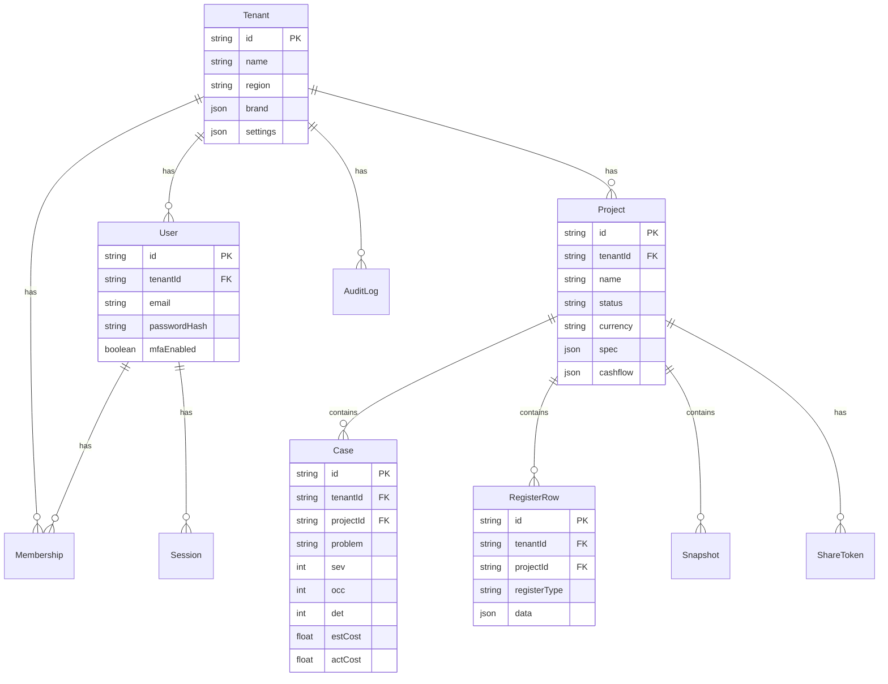
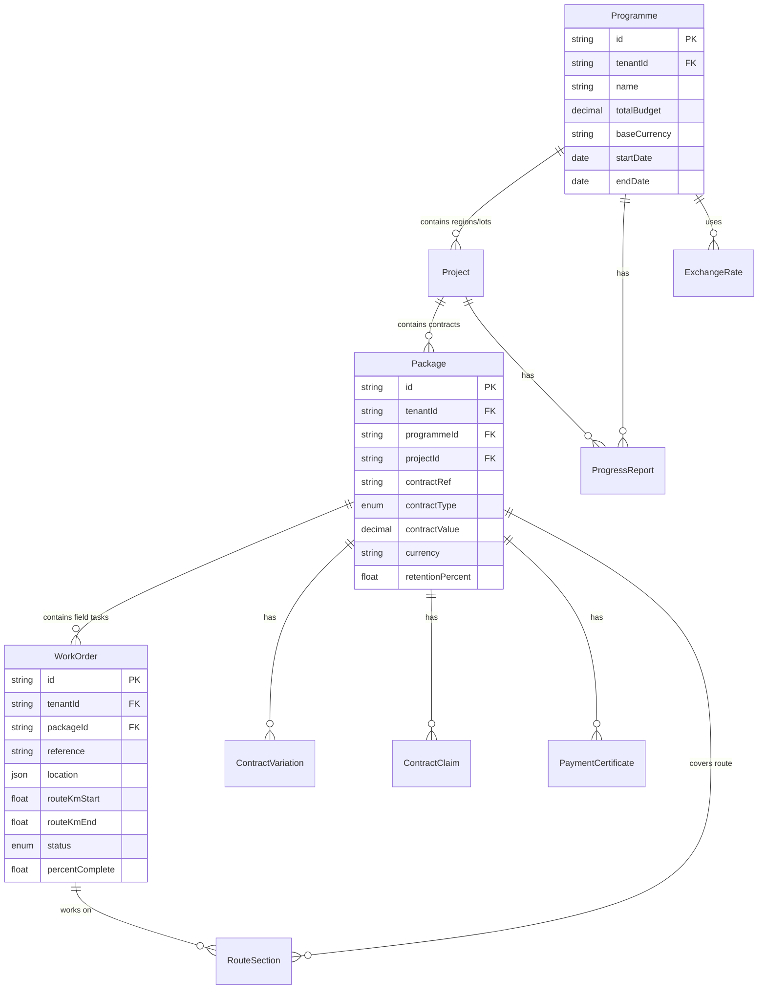
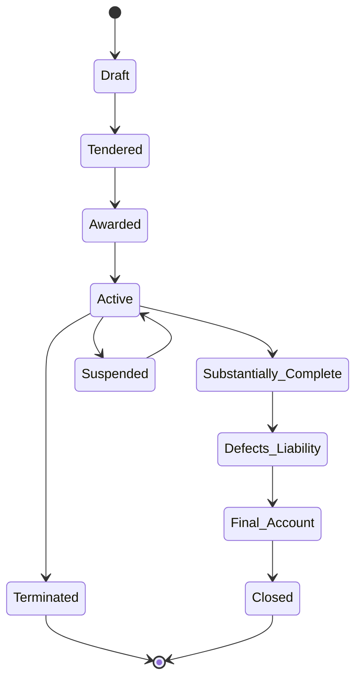
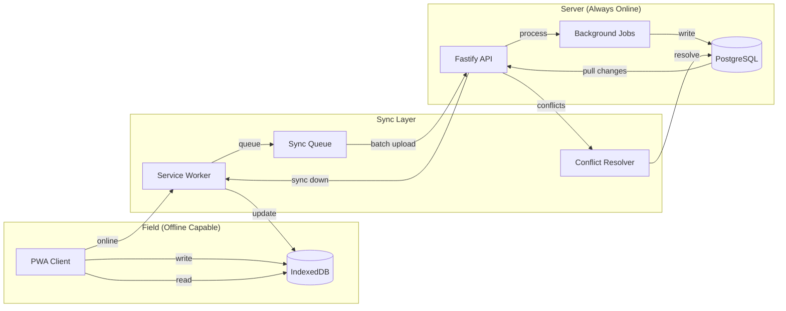
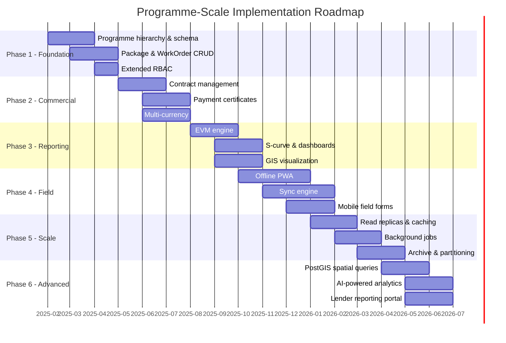

# Programme-Scale Architecture

## QI Platform Evolution: Fibre Optic Network Deployment Management

**Version:** 1.0  
**Date:** 2025-01-15  
**Scope:** $1.3 Billion USD, 5-Year Fibre Optic Network Deployment in Asia  
**Classification:** Internal Architecture Document

---

## Table of Contents

1. [Executive Summary](#1-executive-summary)
2. [Current State](#2-current-state)
3. [Programme Data Hierarchy](#3-programme-data-hierarchy)
4. [Contract Management Module](#4-contract-management-module)
5. [Multi-Currency Support](#5-multi-currency-support)
6. [GIS/Spatial Integration](#6-gisspatial-integration)
7. [Reporting Engine](#7-reporting-engine)
8. [Field Data Collection](#8-field-data-collection)
9. [Scale & Performance](#9-scale--performance)
10. [Security & Compliance](#10-security--compliance)
11. [Phased Implementation Plan](#11-phased-implementation-plan)
12. [API Design](#12-api-design)
13. [Migration Strategy](#13-migration-strategy)

---

## 1. Executive Summary

### 1.1 Purpose

This document defines the architectural evolution of the QI Platform from a prototype project management tool into a programme-scale management system capable of overseeing a **$1.3 billion USD fibre optic network deployment across Asia over 5 years**.

### 1.2 Programme Characteristics

| Dimension | Scale |
|-----------|-------|
| Total Budget | $1.3 billion USD |
| Duration | 5 years (60 months) |
| Geography | Multiple countries/regions in Asia |
| Infrastructure | Fibre optic cable network (backbone + last-mile) |
| Contract Model | NEC4 and FIDIC-based, multi-package |
| Users | 200+ concurrent (PMO, engineers, contractors, client reps) |
| Data Volume | 50,000+ cases, 1,000+ register rows per type, multi-year history |
| Field Operations | Remote sites with intermittent connectivity |

### 1.3 Design Principles

1. **Additive Evolution** - New capabilities extend the existing schema; nothing breaks the working prototype
2. **Offline-First for Field** - Remote Asian sites need data collection without reliable internet
3. **Multi-Tenant at Programme Level** - A single tenant owns the programme; access is scoped by hierarchy level
4. **Contract-Aware** - The platform understands NEC4/FIDIC commercial processes natively
5. **Auditable at Every Level** - Every change, payment, and decision has a traceable audit trail
6. **5-Year Durability** - Architecture must handle data growth, team changes, and evolving requirements over the full programme life

### 1.4 What Stays the Same

The existing prototype is architecturally sound:
- Fastify + Prisma + PostgreSQL stack
- Multi-tenant isolation via `tenantId`
- RBAC with role hierarchy
- Server-side sessions with Argon2id
- Zod validation at API boundaries
- Soft-delete pattern for GDPR compliance
- Docker-based deployment

---

## 2. Current State

### 2.1 Existing Data Model



### 2.2 Current Capabilities

| Module | Status | Fit for Programme Scale |
|--------|--------|------------------------|
| Authentication (Argon2 + MFA) | Complete | Yes - production ready |
| RBAC (4-level hierarchy) | Complete | Needs extension for programme roles |
| Project CRUD | Complete | Becomes one level in deeper hierarchy |
| Case Management (FMEA/RPN) | Complete | Directly applicable to NCRs, issues |
| Register Rows (13 types) | Complete | Extensible to programme register types |
| Snapshots | Complete | Useful for baseline management |
| Share Tokens | Complete | Needs scope expansion for programme sharing |
| Audit Log | Complete | Core of programme compliance |
| Docker Deployment | Complete | Needs scaling additions |

### 2.3 What the Current Model Lacks

- No hierarchy above Project (no Programme, no Package/Contract grouping)
- Single currency per project
- No contract lifecycle management
- No spatial/GIS awareness
- No earned value or S-curve reporting
- No offline/sync capability
- No concept of work orders or field tasks
- Scale limits (no partitioning, no read replicas, no job queues)

---

## 3. Programme Data Hierarchy

### 3.1 Hierarchy Design

The programme uses a 4-level hierarchy that maps to how large infrastructure deployments are actually managed:

```
Programme (1)
  The overall fibre optic network deployment
    |
    +-- Project (5-15)
    |     Regional lots or geographic segments
    |     e.g., "Northern Corridor", "Metro Ring - City A", "Rural Last-Mile Zone 3"
    |       |
    |       +-- Package (3-10 per project)
    |       |     Individual contracts awarded to contractors
    |       |     e.g., "Backbone Duct Installation - Lot N1"
    |       |     e.g., "OTDR Testing & Commissioning - Metro A"
    |       |       |
    |       |       +-- WorkOrder (10-500 per package)
    |       |             Field-level tasks with location
    |       |             e.g., "Splice closure #247, km 34.2-34.8"
    |       |             e.g., "Trench excavation, Main St section"
```

### 3.2 How Existing Models Map

| Current Model | Programme Role | Change Required |
|---------------|---------------|-----------------|
| `Tenant` | Organisation owning the programme | None |
| `Project` | Becomes a **Project** (regional lot) within Programme | Add optional `programmeId` FK |
| `Case` | Issues, NCRs, risks at any hierarchy level | Add optional `packageId`, `workOrderId` |
| `RegisterRow` | Registers scoped to programme/project/package | Add optional `programmeId`, `packageId` |
| `Snapshot` | Baseline captures at project level | No change needed |
| `AuditLog` | Programme-wide audit trail | Add `programmeId` context field |

### 3.3 Entity Relationships



### 3.4 Access Scoping

Users are granted access at a hierarchy level, and that access cascades down:

| Access Level | Can See | Typical Role |
|--------------|---------|--------------|
| Programme | Everything | PMO Director, Client Rep |
| Project | All packages/WOs in that project | Regional Manager |
| Package | All WOs in that package | Package Manager, Contractor Lead |
| WorkOrder | Just their assigned tasks | Field Engineer |

This extends the existing RBAC model by adding `scopeLevel` and `scopeId` to Membership:

```typescript
// Extended membership for programme hierarchy
model Membership {
  // ... existing fields ...
  scopeLevel  String?  // "programme" | "project" | "package" | null (tenant-wide)
  scopeId     String?  // ID of the programme/project/package
}
```

---

## 4. Contract Management Module

### 4.1 Contract Types

The platform supports two major international contract frameworks used in Asian infrastructure:

| Framework | Variants | Use Case |
|-----------|----------|----------|
| **NEC4** | ECC Option A (Priced, Activity Schedule), Option B (Priced, BoQ), Option C (Target, Activity Schedule), Option D (Target, BoQ) | UK-influenced markets, newer projects |
| **FIDIC** | Red Book (Employer-designed), Yellow Book (Contractor-designed), Silver Book (EPC/Turnkey) | International development bank funded projects |

### 4.2 Contract Lifecycle



### 4.3 Variations (Change Orders)

Variations are changes to the contracted scope. Both NEC4 and FIDIC have formal variation processes:

**Data Model:**
```
ContractVariation {
  id, tenantId, packageId
  reference          -- e.g., "VO-023"
  title              -- short description
  description        -- detailed scope change
  reason             -- why the change is needed
  impactAssessment   -- contractor's assessment (Json)
  amount             -- claimed/approved value (Decimal)
  currency
  timeImpactDays     -- extension of time claimed
  status             -- PROPOSED > ASSESSED > APPROVED/REJECTED > IMPLEMENTED
  submittedDate
  assessedDate
  approvedDate
  approvedBy
  metadata           -- extensible (attached docs, correspondence refs)
}
```

**Workflow:**
1. Contractor identifies a change and submits a variation proposal
2. Engineer/PM assesses time and cost impact
3. Client/Employer approves or rejects
4. If approved, contract sum and programme are adjusted
5. Variation is tracked through to implementation and final measurement

### 4.4 Claims

Claims arise from events entitling one party to additional payment or time:

**Claim Types:**
- Compensation Events (NEC4) / Claims under Sub-Clause 20.1 (FIDIC)
- Extension of Time (EOT)
- Prolongation costs
- Disruption claims
- Acceleration claims

**Data Model:**
```
ContractClaim {
  id, tenantId, packageId
  reference           -- e.g., "CE-015" or "CLM-008"
  claimType           -- COMPENSATION_EVENT, EOT, PROLONGATION, etc.
  title
  description
  contractClause      -- specific clause relied upon
  amount              -- claimed amount (Decimal)
  assessedAmount      -- engineer's assessed amount (Decimal)
  currency
  timeClaimedDays
  timeAwardedDays
  status              -- DRAFT > SUBMITTED > ASSESSED > AGREED/DISPUTED > PAID
  submittedDate
  responseDeadline    -- contractual response period
  assessedDate
  agreedDate
  metadata            -- supporting documents, notices
}
```

### 4.5 Payment Certificates

Monthly or milestone-based payment processing:

```
PaymentCertificate {
  id, tenantId, packageId
  certNumber          -- sequential per package (IPC-001, IPC-002...)
  periodStart, periodEnd
  
  -- Amounts
  workDoneThisPeriod  -- value of work completed
  materialsOnSite     -- advance for stored materials
  variationsIncluded  -- approved variations value
  grossAmount         -- total before deductions
  retention           -- held back (typically 5-10%)
  previousPayments    -- cumulative previous certs
  netAmount           -- payable this period
  currency
  
  -- Status
  status              -- DRAFT > SUBMITTED > CERTIFIED > APPROVED > PAID
  submittedDate
  certifiedDate       -- engineer certifies
  approvedDate        -- client approves
  paidDate
  paymentRef          -- bank reference
  metadata
}
```

### 4.6 Retention Management

Retention is held from each payment and released in two stages:
1. **First half** released at Substantial Completion
2. **Second half** released at end of Defects Liability Period

The platform tracks:
- Cumulative retention held per package
- Retention release triggers (linked to contract milestones)
- Retention balance vs. maximum retention cap

---

## 5. Multi-Currency Support

### 5.1 Currency Strategy

| Aspect | Approach |
|--------|----------|
| Programme base currency | USD (all consolidation/reporting in USD) |
| Contract currency | Per package (local currency where contractor is paid) |
| Exchange rate source | Manual entry + optional API feed |
| Conversion timing | Transaction date rate for actuals; budget rate for forecasts |
| Revaluation | Monthly for management reporting |

### 5.2 Exchange Rate Model

```
ExchangeRate {
  id, tenantId
  fromCurrency     -- ISO 4217 (e.g., "USD")
  toCurrency       -- ISO 4217 (e.g., "MMK", "VND", "PHP")
  rate             -- Decimal(20,8) for precision
  effectiveDate    -- date this rate applies from
  source           -- "MANUAL" | "API" | "CENTRAL_BANK"
  metadata         -- source reference, who entered it
}
```

### 5.3 Currency Operations

1. **Budget Entry** - in programme base currency (USD)
2. **Contract Values** - in contract currency
3. **Payment Processing** - in contract currency
4. **Progress Reporting** - converted to USD at period-end rate
5. **Variance Analysis** - separate currency variance from cost variance
6. **Forecast to Complete** - in both contract and base currency

### 5.4 Supported Currencies (Initial)

Based on typical Asian fibre deployments:
- USD (base), EUR, GBP
- CNY (Chinese Yuan), JPY (Japanese Yen)
- INR (Indian Rupee), BDT (Bangladeshi Taka)
- VND (Vietnamese Dong), THB (Thai Baht)
- MMK (Myanmar Kyat), PHP (Philippine Peso)
- IDR (Indonesian Rupiah), MYR (Malaysian Ringgit)

---

## 6. GIS/Spatial Integration

### 6.1 Why GIS Matters for Fibre Deployment

Fibre optic cable follows physical routes. Progress is measured in kilometres. Work orders are assigned by location. Issues (breaks, damage, access problems) are geolocated. The platform must be spatially aware.

### 6.2 Spatial Data Model

```
RouteSection {
  id, tenantId
  packageId         -- which contract covers this section
  workOrderId       -- which work order (nullable - planned vs assigned)
  name              -- "Backbone Route A, Section 14"
  kmStart           -- 34.200 (km marker from route origin)
  kmEnd             -- 34.800
  coordinates       -- GeoJSON LineString (Json field)
  
  -- Cable specification
  cableType         -- "G.652.D single-mode", "G.657.A2 bend-insensitive"
  fibreCount        -- 48, 96, 144, 288
  ductType          -- "HDPE 40mm", "Microduct 12/10"
  
  -- Status tracking
  status            -- PLANNED, SURVEYED, PERMITTED, TRENCHED, DUCTED, CABLED, SPLICED, TESTED, LIVE
  
  -- Dates
  surveyedDate
  installedDate
  splicedDate
  testedDate
  commissionedDate
  
  -- Test results
  otdrResults       -- Json (OTDR trace summary per fibre)
  insertionLoss     -- measured dB
  reflectance       -- measured dB
  
  metadata          -- extensible (photos, permits, access agreements)
}
```

### 6.3 Coordinate Storage

GeoJSON is stored as Json in Prisma (PostgreSQL JSONB):

```json
{
  "type": "LineString",
  "coordinates": [
    [103.8198, 1.3521],
    [103.8201, 1.3524],
    [103.8205, 1.3528]
  ],
  "properties": {
    "crs": "EPSG:4326",
    "accuracy": "survey-grade"
  }
}
```

For advanced spatial queries, a future phase adds PostGIS extension:
```sql
ALTER TABLE "RouteSection" ADD COLUMN geom geometry(LineString, 4326);
CREATE INDEX idx_route_section_geom ON "RouteSection" USING GIST(geom);
```

### 6.4 Progress by Km-Section

The platform calculates route completion:

| Metric | Calculation |
|--------|-------------|
| Total route length | Sum of (kmEnd - kmStart) for all RouteSections |
| Installed length | Sum where status >= CABLED |
| Tested length | Sum where status >= TESTED |
| Live length | Sum where status = LIVE |
| % Complete | Installed / Total * 100 |

### 6.5 Integration Points

| Service | Purpose | Phase |
|---------|---------|-------|
| OpenStreetMap/Mapbox | Base map rendering | Phase 3 |
| Custom tile server | Route overlay display | Phase 3 |
| GPS field devices | Coordinate capture for as-built | Phase 4 |
| PostGIS | Server-side spatial queries | Phase 4 |
| Google Earth KML export | Client reporting | Phase 3 |

---

## 7. Reporting Engine

### 7.1 Report Types

| Report | Frequency | Audience | Content |
|--------|-----------|----------|---------|
| Monthly Progress Report | Monthly | Client, Lender | Physical + financial progress, issues, forecast |
| EVM Performance Report | Monthly | PMO | CPI, SPI, EAC, ETC, variance analysis |
| Disbursement Forecast | Quarterly | Lender, Finance | Cash flow projection by quarter |
| Package Status Report | Weekly | PMO, Package Manager | Work order status, blockers, resources |
| Quality/NCR Report | Monthly | QA Manager | Non-conformances, resolution rates |
| Safety Report | Monthly | HSE Manager | Incidents, near-misses, compliance |
| Board Report | Quarterly | Steering Committee | Executive summary, key decisions needed |

### 7.2 Earned Value Management (EVM)

EVM is the standard method for measuring programme performance on large infrastructure projects.

**Core Metrics:**

| Metric | Formula | Meaning |
|--------|---------|---------|
| PV (Planned Value) | Budget * planned % complete | What we planned to spend by now |
| EV (Earned Value) | Budget * actual % complete | Value of work actually done |
| AC (Actual Cost) | Sum of actual expenditure | What we actually spent |
| SV (Schedule Variance) | EV - PV | Ahead/behind schedule (in $) |
| CV (Cost Variance) | EV - AC | Under/over budget |
| SPI (Schedule Performance Index) | EV / PV | < 1 = behind, > 1 = ahead |
| CPI (Cost Performance Index) | EV / AC | < 1 = over budget, > 1 = under |
| EAC (Estimate at Completion) | BAC / CPI | Projected final cost |
| ETC (Estimate to Complete) | EAC - AC | Remaining cost |
| TCPI (To-Complete Performance Index) | (BAC - EV) / (BAC - AC) | Required CPI to finish on budget |

**S-Curve Data Model:**

```
ProgressReport {
  id, tenantId
  programmeId        -- programme-level roll-up
  projectId          -- project-level (optional, null = programme-wide)
  packageId          -- package-level (optional)
  
  period             -- "2025-03" (year-month)
  reportDate         -- actual report generation date
  
  -- Physical Progress
  plannedProgress    -- 0.0 to 1.0 (percentage as decimal)
  actualProgress     -- 0.0 to 1.0
  
  -- EVM Values (in base currency - USD)
  budgetAtCompletion -- BAC (Decimal)
  plannedValue       -- PV (Decimal)
  earnedValue        -- EV (Decimal)
  actualCost         -- AC (Decimal)
  
  -- Derived (stored for query performance)
  spiValue           -- Float
  cpiValue           -- Float
  eacValue           -- Decimal
  etcValue           -- Decimal
  
  -- Narrative
  narrative          -- free-text commentary
  keyIssues          -- Json array of issue summaries
  keyRisks           -- Json array of risk summaries
  decisionsRequired  -- Json array
  
  -- Forecast
  forecastCompletion -- revised completion date
  forecastCost       -- revised total cost (Decimal)
  
  metadata           -- attached documents, distribution list
}
```

### 7.3 S-Curve Visualization

The S-curve plots PV, EV, and AC over time. The platform generates this from `ProgressReport` records:

```
Time (months) -->
$$$
|                          ___--- BAC
|                     __--/
|                 __-/ 
|             __-/     <-- PV (planned)
|          _-/    
|        _/   ___....--- EV (earned - actual progress)
|      _/ __../
|    _/../
|  _/./        <-- AC (actual cost)
| //
|/
+---------------------------------> Time
```

### 7.4 Disbursement Forecast

For lender reporting, the platform projects future cash needs:

1. Remaining contract values by package
2. Weighted by planned expenditure profile (S-curve shape)
3. Adjusted for actual progress vs plan
4. Split by currency with USD consolidation
5. Presented quarterly for the next 8 quarters

### 7.5 Dashboard KPIs

Real-time programme dashboard:

| KPI | Target | Source |
|-----|--------|--------|
| Overall SPI | >= 0.95 | ProgressReport |
| Overall CPI | >= 0.95 | ProgressReport |
| Route km installed | vs plan | RouteSection |
| Active NCRs | < 20 | Case (type=NCR, status=OPEN) |
| Payment certs pending | < 5 | PaymentCertificate (status=SUBMITTED) |
| Variations pending approval | < 10 | ContractVariation (status=PROPOSED) |
| Claims unresolved | < 5 | ContractClaim (status!=AGREED,PAID) |
| Field sync backlog | < 100 records | SyncQueue (syncedAt=null) |

---

## 8. Field Data Collection

### 8.1 The Challenge

Fibre optic cable routes in Asia often traverse remote areas with unreliable mobile connectivity:
- Mountain passes and jungle terrain
- Rural villages with no 4G coverage
- Underground and tunnel sections
- Offshore cable landing points

Field engineers must record:
- Work progress (metres installed, splices completed)
- Quality checks (OTDR results, visual inspections)
- Issues (access denied, ground conditions, damage)
- GPS coordinates of installed infrastructure
- Photos of completed work

### 8.2 Offline-First Architecture



### 8.3 Sync Queue Model

```
SyncQueue {
  id, tenantId
  userId             -- who created this record
  deviceId           -- which device (for conflict tracking)
  
  entityType         -- "WorkOrder", "RouteSection", "Case"
  entityId           -- target record ID (or temp UUID for creates)
  operation          -- "CREATE" | "UPDATE" | "DELETE"
  
  payload            -- Json (the full change payload)
  
  -- Versioning for conflict detection
  baseVersion        -- the version the client had when making the change
  
  -- Status
  createdAt          -- when created on device
  queuedAt           -- when added to upload queue
  syncedAt           -- when server processed (null = pending)
  
  -- Conflict handling
  conflictDetected   -- boolean
  conflictResolution -- Json (how it was resolved, null if no conflict)
  
  -- Retry
  attempts           -- number of sync attempts
  lastError          -- last failure reason
}
```

### 8.4 Conflict Resolution Strategy

| Conflict Type | Resolution |
|---------------|------------|
| Same field, same record, different values | Last-write-wins with full history preserved |
| Status progression conflict | Higher status wins (can't un-complete work) |
| Numeric progress conflict | Take the higher value (progress only goes forward) |
| Location/coordinate conflict | Server value wins (GPS is non-subjective) |
| Delete vs. Update | Update wins (preserve data, flag for review) |

All conflicts are logged and flagged for manual review by the Package Manager.

### 8.5 Mobile PWA Requirements

| Feature | Implementation |
|---------|---------------|
| Offline storage | IndexedDB via Dexie.js (structured) |
| Background sync | Service Worker + Background Sync API |
| Camera access | MediaDevices API for photo capture |
| GPS | Geolocation API with high-accuracy mode |
| Minimum payload | Only sync changed fields, not full records |
| Compression | gzip payloads for slow connections |
| Batch upload | Group multiple changes into single HTTP request |
| Resumable | Track last successful sync point per device |

### 8.6 Data Freshness Tiers

| Data Type | Acceptable Staleness | Sync Priority |
|-----------|---------------------|---------------|
| Work order assignments | 4 hours | High |
| Route section status | 8 hours | High |
| Payment certificates | 24 hours | Medium |
| Programme reports | 1 week | Low |
| Reference data (cable specs, standards) | 1 month | Low |

---

## 9. Scale & Performance

### 9.1 Volume Projections (5 Years)

| Entity | Year 1 | Year 3 | Year 5 |
|--------|--------|--------|--------|
| Projects | 5 | 12 | 15 |
| Packages | 20 | 60 | 80 |
| Work Orders | 2,000 | 15,000 | 30,000 |
| Cases (issues/NCRs) | 5,000 | 25,000 | 50,000+ |
| Register Rows | 10,000 | 50,000 | 100,000+ |
| Route Sections | 500 | 3,000 | 8,000 |
| Payment Certificates | 200 | 1,500 | 3,000 |
| Progress Reports | 50 | 300 | 600 |
| Audit Log entries | 100,000 | 1,000,000 | 3,000,000+ |
| Sync Queue (daily) | 500 | 2,000 | 3,000 |

### 9.2 Database Strategy

**Phase 1-2: Single PostgreSQL (sufficient for Year 1-2)**
- Standard indexes on tenantId, status fields, date ranges
- JSONB GIN indexes for metadata queries
- Connection pooling via PgBouncer (max 200 connections)

**Phase 3-4: Scaling additions**
- Read replica for reporting queries (separate `DATABASE_READ_URL`)
- Table partitioning for AuditLog (by month) and SyncQueue (by date)
- Materialized views for dashboard KPIs (refreshed every 5 minutes)
- Archive strategy: move completed/closed records older than 2 years to archive tables

**Phase 5-6: Full scale**
- PostGIS extension for spatial queries
- TimescaleDB extension for time-series EVM data (optional)
- Redis for session cache and real-time sync coordination
- Background job queue (BullMQ with Redis) for report generation, sync processing

### 9.3 API Performance Targets

| Operation | Target | Approach |
|-----------|--------|----------|
| List endpoints (paginated) | < 200ms | Cursor-based pagination, indexed queries |
| Single record fetch | < 50ms | Primary key lookup |
| Create/Update | < 300ms | Async audit log write |
| Report generation | < 10s | Pre-computed materialized views |
| S-curve data | < 2s | Cached aggregation |
| Sync batch (50 records) | < 5s | Bulk insert/upsert |
| Full programme dashboard | < 3s | Materialized KPIs + cache |

### 9.4 Caching Strategy

| Layer | Technology | TTL | Content |
|-------|-----------|-----|---------|
| API Response | In-memory (Fastify cache) | 60s | List endpoints, dashboard |
| Session | Redis | 24h | User sessions (replaces DB lookup) |
| EVM Aggregates | Materialized View | 5min | Dashboard KPIs |
| Exchange Rates | In-memory | 1h | Current rates |
| Reference Data | Redis | 24h | Cable specs, standards |

### 9.5 Background Jobs

| Job | Schedule | Purpose |
|-----|----------|---------|
| Sync processor | Continuous | Process SyncQueue entries |
| EVM calculator | Daily 02:00 | Recompute EVM metrics |
| Report generator | Monthly 1st | Auto-generate monthly reports |
| Audit archiver | Weekly Sun | Move old audit logs to archive |
| Session cleanup | Hourly | Remove expired sessions |
| Exchange rate fetch | Daily 09:00 | Pull rates from API (if configured) |

---

## 10. Security & Compliance

### 10.1 Extended RBAC Model

The programme hierarchy requires more granular roles:

| Role | Programme | Project | Package | Work Order |
|------|-----------|---------|---------|------------|
| PROGRAMME_DIRECTOR | Full access | All | All | All |
| PROJECT_MANAGER | Read | Full (own) | All (own) | All (own) |
| PACKAGE_MANAGER | Read | Read (own) | Full (own) | All (own) |
| FIELD_ENGINEER | None | None | Read (own) | Full (assigned) |
| CONTRACTOR_REP | None | None | Read (own) | Read (own) |
| CLIENT_REP | Read-only all | Read-only | Read-only | Read-only |
| FINANCE | Payments only | Payments | Payments | None |
| QA_AUDITOR | Read all | Read all | Read all | Read all |

### 10.2 Data Classification

| Level | Examples | Storage | Access |
|-------|----------|---------|--------|
| Public | Project names, route maps (approximate) | Standard | All authenticated users |
| Internal | Progress reports, KPIs, schedules | Standard | Role-appropriate |
| Confidential | Contract values, payment amounts, claims | Encrypted at rest | Finance + Managers |
| Restricted | Commercial strategy, bid evaluations | Encrypted + audit every access | Named individuals only |

### 10.3 Compliance Requirements

| Requirement | Implementation |
|-------------|---------------|
| Data residency | Configurable per-region; `Tenant.region` drives data location |
| Right to erasure (GDPR) | Soft-delete cascade through hierarchy |
| Audit trail | Every mutation logged with actor, timestamp, before/after |
| Document retention | 7 years minimum for financial records (configurable) |
| Access logging | All data access by Confidential+ records is logged |
| Segregation of duties | Payment creation vs. approval requires different users |
| Multi-factor auth | Required for ADMIN+ roles and all financial operations |

### 10.4 API Security Enhancements

| Enhancement | Purpose |
|-------------|---------|
| Request signing | Verify field device identity for sync |
| IP allowlisting | Restrict admin operations to office networks |
| Rate limiting per tier | Different limits for field sync vs. web UI |
| JWT for service-to-service | Microservice auth when platform scales |
| Webhook signatures | Verify outbound notifications |

---

## 11. Phased Implementation Plan

### 11.1 Phase Timeline



### 11.2 Phase 1: Foundation (Months 1-3)

**Goal:** Establish programme hierarchy and make existing features work within it.

| Deliverable | Detail |
|-------------|--------|
| Programme model | Schema + CRUD + programme-level dashboard |
| Package model | Schema + CRUD + contract metadata |
| WorkOrder model | Schema + CRUD + status workflow |
| Extended RBAC | Hierarchy-scoped access control |
| Migration script | Existing Projects get optional programmeId |
| API versioning | /api/v1/ prefix for all new endpoints |

**Exit Criteria:** A user can create a Programme, add Projects, create Packages with contract details, and assign Work Orders. Access is scoped by hierarchy level.

### 11.3 Phase 2: Commercial (Months 4-6)

**Goal:** Full contract lifecycle management with financial tracking.

| Deliverable | Detail |
|-------------|--------|
| Contract Variations | Full CRUD + workflow + approval chain |
| Contract Claims | NEC4 CE and FIDIC claims with deadlines |
| Payment Certificates | Monthly cert generation + approval workflow |
| Multi-currency | Exchange rates + conversion at all financial touchpoints |
| Retention tracking | Automatic calculation + release triggers |
| Financial dashboards | Contract values, committed, certified, paid |

**Exit Criteria:** A complete payment cycle can be executed: work done > certified > approved > paid. Variations and claims adjust contract values. All amounts work in local + base currency.

### 11.4 Phase 3: Reporting & GIS (Months 7-9)

**Goal:** Automated programme reporting and spatial awareness.

| Deliverable | Detail |
|-------------|--------|
| EVM calculation engine | Automated PV/EV/AC/SPI/CPI computation |
| S-curve generation | Time-series data for S-curve charts |
| Monthly report automation | Template-based report generation |
| Route section tracking | Km-based progress tracking |
| Map visualization | Route display with progress colouring |
| KML/GeoJSON export | For client presentations |

**Exit Criteria:** Monthly EVM reports are generated automatically. Route progress is visible on a map. S-curves show planned vs actual.

### 11.5 Phase 4: Field Operations (Months 9-12)

**Goal:** Offline-first field data collection.

| Deliverable | Detail |
|-------------|--------|
| PWA shell | Installable, offline-capable app shell |
| IndexedDB layer | Local storage with sync queue |
| Field forms | Work order updates, quality checks, photos |
| GPS capture | As-built coordinate recording |
| Background sync | Automatic upload when connection available |
| Conflict resolution | Automated + manual review workflow |

**Exit Criteria:** A field engineer can go offline, record work progress and quality data, take photos with GPS, and have everything sync automatically when connectivity returns.

### 11.6 Phase 5: Scale (Months 10-14)

**Goal:** Platform handles full programme volume without performance degradation.

| Deliverable | Detail |
|-------------|--------|
| Read replica | Reporting queries offloaded |
| Redis caching | Sessions, reference data, API responses |
| Table partitioning | AuditLog and SyncQueue partitioned by date |
| BullMQ job system | Report generation, sync processing, archival |
| Archive workflow | Old data moved to archive tables |
| Performance testing | Load test to 200 concurrent users |

**Exit Criteria:** API response times meet targets (Section 9.3) under full load. 200 concurrent users, 3M+ audit records, 30K+ work orders.

### 11.7 Phase 6: Advanced (Months 13-18)

**Goal:** Advanced analytics, spatial queries, and external integrations.

| Deliverable | Detail |
|-------------|--------|
| PostGIS | Native spatial queries (route proximity, coverage gaps) |
| AI analytics | Predictive completion dates, anomaly detection |
| Lender portal | Read-only portal for development bank representatives |
| Custom report builder | User-defined report templates |
| API webhooks | Event notifications to external systems |
| Mobile native (optional) | iOS/Android app for field engineers |

**Exit Criteria:** Platform is fully operational for the remaining 3+ years of the programme with all advanced features available.

---

## 12. API Design

### 12.1 URL Structure

All new endpoints use a versioned, hierarchical URL pattern:

```
/api/v1/programmes
/api/v1/programmes/:programmeId
/api/v1/programmes/:programmeId/projects
/api/v1/programmes/:programmeId/projects/:projectId/packages
/api/v1/programmes/:programmeId/projects/:projectId/packages/:packageId
/api/v1/programmes/:programmeId/projects/:projectId/packages/:packageId/work-orders
/api/v1/programmes/:programmeId/projects/:projectId/packages/:packageId/work-orders/:woId
/api/v1/programmes/:programmeId/projects/:projectId/packages/:packageId/variations
/api/v1/programmes/:programmeId/projects/:projectId/packages/:packageId/claims
/api/v1/programmes/:programmeId/projects/:projectId/packages/:packageId/payments
/api/v1/programmes/:programmeId/reports
/api/v1/programmes/:programmeId/exchange-rates
/api/v1/sync/upload
/api/v1/sync/download
/api/v1/sync/status
```

### 12.2 Pagination

All list endpoints use cursor-based pagination for stable results with growing datasets:

```typescript
// Request
GET /api/v1/programmes/:id/work-orders?cursor=abc123&limit=50&status=IN_PROGRESS

// Response
{
  "data": [...],
  "pagination": {
    "cursor": "xyz789",       // pass this as ?cursor= for next page
    "hasMore": true,
    "total": 15234            // total matching records (optional, expensive)
  }
}
```

### 12.3 Filtering & Sorting

```
GET /api/v1/.../work-orders?
  status=IN_PROGRESS,COMPLETED&     // multi-value filter (OR)
  packageId=pkg_abc&                 // exact match
  kmStart_gte=10.0&                  // range filter (gte, lte, gt, lt)
  kmEnd_lte=50.0&
  sort=-percentComplete,createdAt&   // sort (- prefix = descending)
  fields=id,reference,status,percentComplete  // sparse fieldset
```

### 12.4 Bulk Operations

For field sync and batch imports:

```typescript
// Batch create/update
POST /api/v1/sync/upload
{
  "deviceId": "field-tablet-007",
  "operations": [
    { "entityType": "WorkOrder", "entityId": "wo_123", "op": "UPDATE", "payload": {...}, "baseVersion": 5 },
    { "entityType": "RouteSection", "entityId": null, "op": "CREATE", "payload": {...} }
  ]
}

// Response
{
  "processed": 48,
  "conflicts": 2,
  "conflictDetails": [
    { "entityType": "WorkOrder", "entityId": "wo_123", "resolution": "server_wins", "reason": "status_progression" }
  ]
}
```

### 12.5 Real-Time Updates (Phase 5+)

Server-Sent Events for dashboard real-time updates:

```
GET /api/v1/programmes/:id/events
Content-Type: text/event-stream

event: progress-update
data: {"packageId":"pkg_abc","percentComplete":0.73,"updatedAt":"..."}

event: payment-certified
data: {"certId":"cert_045","amount":245000,"currency":"USD"}
```

### 12.6 API Authentication

| Method | Use Case |
|--------|----------|
| Session cookie | Web UI (existing) |
| Bearer token | Service-to-service, CI/CD |
| API key + HMAC | Field device sync |
| Share token | Read-only external access |

---

## 13. Migration Strategy

### 13.1 Principles

1. **Zero downtime** - existing features keep working throughout migration
2. **Additive only** - new tables and optional fields; no destructive changes
3. **Backward compatible** - existing API endpoints continue to work
4. **Opt-in** - existing projects gain programme features only when explicitly linked

### 13.2 Schema Migration Steps

**Step 1: Add new models (non-breaking)**
```sql
-- New tables: Programme, Package, WorkOrder, ContractVariation, etc.
-- These are independent; nothing references them yet
```

**Step 2: Add optional FK to Project**
```sql
ALTER TABLE "Project" ADD COLUMN "programmeId" TEXT;
ALTER TABLE "Project" ADD CONSTRAINT "Project_programmeId_fkey" 
  FOREIGN KEY ("programmeId") REFERENCES "Programme"("id") ON DELETE SET NULL;
```

**Step 3: Add optional FKs to Case and RegisterRow**
```sql
ALTER TABLE "Case" ADD COLUMN "packageId" TEXT;
ALTER TABLE "Case" ADD COLUMN "workOrderId" TEXT;
ALTER TABLE "RegisterRow" ADD COLUMN "programmeId" TEXT;
ALTER TABLE "RegisterRow" ADD COLUMN "packageId" TEXT;
```

All additions are nullable. Existing data is untouched. Existing queries continue to work because they filter on fields that still exist unchanged.

### 13.3 Data Migration

For existing tenants upgrading to programme-scale:

1. Create a Programme record with the tenant's overall scope
2. Link existing Projects to the Programme (set `programmeId`)
3. Create Package records for known contracts (manual or import)
4. Existing Cases and RegisterRows remain at Project level
5. New Cases/RegisterRows can be linked to Packages/WorkOrders

This is a **gradual adoption** model -- teams start using programme features as they are ready.

### 13.4 API Compatibility

| Existing Endpoint | Change | Reason |
|-------------------|--------|--------|
| `GET /projects` | Unchanged | Still returns tenant projects |
| `POST /projects` | Add optional `programmeId` field | Backward compatible |
| `GET /cases` | Unchanged | Still filterable by projectId |
| `POST /cases` | Add optional `packageId`, `workOrderId` | Backward compatible |
| All other endpoints | Unchanged | No modification needed |

New programme-aware endpoints live under `/api/v1/programmes/...` and do not conflict with existing routes.

### 13.5 Frontend Migration

The existing `qi-webapp` continues to work as-is. Programme features are accessed through new UI pages that use the new API routes:

1. **Phase 1:** New "Programme" navigation item appears only if `programmeId` exists on any project
2. **Phase 2:** Commercial pages (contracts, payments) added as new sections
3. **Phase 3:** Reporting dashboard with EVM charts
4. **Phase 4:** Field app is a separate PWA that shares the same API

---

## Appendix A: Technology Decisions

| Decision | Choice | Rationale |
|----------|--------|-----------|
| Database | PostgreSQL (keep) | Mature, PostGIS support, JSONB, proven at scale |
| ORM | Prisma (keep) | Type-safe, good migration tooling, team familiarity |
| API framework | Fastify (keep) | Fast, plugin architecture, proven in production |
| Job queue | BullMQ + Redis | Mature, persistent, retry/backoff built-in |
| Caching | Redis | Session store + API cache + pub/sub for real-time |
| Map rendering | Mapbox GL JS or Leaflet | Client-side, works offline with cached tiles |
| Offline storage | IndexedDB via Dexie.js | Structured, large capacity, good browser support |
| Spatial DB | PostGIS (Phase 6) | Industry standard for GIS in PostgreSQL |
| Reporting charts | D3.js or Chart.js | S-curves, gantt charts, programme dashboards |
| PDF generation | Puppeteer or wkhtmltopdf | Monthly report PDF export |
| File storage | S3-compatible (MinIO) | Document attachments, photos from field |
| Real-time | Server-Sent Events | Simpler than WebSockets for one-way updates |

## Appendix B: Key Risks

| Risk | Mitigation |
|------|-----------|
| Scope creep in Phase 1-2 | Strict feature freeze per phase; backlog for later |
| Connectivity worse than expected | Aggressive offline-first; minimize sync payload |
| Team scaling challenges | Clear module boundaries; each phase is independently testable |
| Data volume exceeds projections | Partitioning strategy designed from start; archive old data |
| Contract framework changes | Extensible metadata Json fields for custom clauses |
| Currency volatility | Store original currency + rate at transaction time; revalue only for reporting |
| Regulatory changes (data residency) | Per-tenant region config; data never crosses region boundary |

## Appendix C: Glossary

| Term | Definition |
|------|-----------|
| Programme | The overall $1.3B fibre deployment initiative |
| Project | A geographic region or lot within the programme |
| Package | A single contract awarded to a contractor |
| Work Order | A field-level task within a package |
| NEC4 | New Engineering Contract, 4th edition (UK standard) |
| FIDIC | International Federation of Consulting Engineers contract suite |
| EVM | Earned Value Management - performance measurement methodology |
| SPI | Schedule Performance Index (EV/PV) |
| CPI | Cost Performance Index (EV/AC) |
| BAC | Budget at Completion |
| EAC | Estimate at Completion |
| OTDR | Optical Time-Domain Reflectometer (fibre testing instrument) |
| NCR | Non-Conformance Report |
| IPC | Interim Payment Certificate |
| EOT | Extension of Time |
| CE | Compensation Event (NEC4 term) |
| BoQ | Bill of Quantities |
| DLP | Defects Liability Period |
